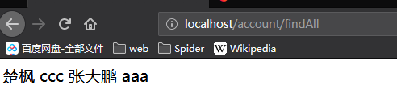

# Spring零基础入门教程

> 作者: 张大鹏

## 001.常用IOC注解按照作用分类

1.引入`spring`依赖

```xml
<?xml version="1.0" encoding="UTF-8"?>
<project xmlns="http://maven.apache.org/POM/4.0.0"
         xmlns:xsi="http://www.w3.org/2001/XMLSchema-instance"
         xsi:schemaLocation="http://maven.apache.org/POM/4.0.0 http://maven.apache.org/xsd/maven-4.0.0.xsd">
    <modelVersion>4.0.0</modelVersion>

    <groupId>com.lxgzhw</groupId>
    <artifactId>day02_01_Anotation_IOC</artifactId>
    <version>1.0-SNAPSHOT</version>
    <packaging>jar</packaging>

    <dependencies>
        <dependency>
            <groupId>org.springframework</groupId>
            <artifactId>spring-context</artifactId>
            <version>5.0.2.RELEASE</version>
        </dependency>
    </dependencies>
</project>
```

2.注解的分类

```
1.用于创建对象的
	作用:和在xml配置文件中编写一个<bean>标签实现的功能一样
			
2.用于注入数据的
	作用:和在xml的bean标签中写一个property标签一样

3.用于改变作用范围的
	作用:和在xml的bean标签使用scope属性一样

4.和生命周期相关
	作用:和在xml的bean标签中使用	init-method和destroy-method一样
```

3.	@Component
	
	```
	作用:用于把当前类对象存入spring容器中
	属性:
		value:用于指定bean的id,默认值是当前类型首字母改小写
	```
	
	

4.导入context的配置

> 需要在`resources`文件夹下新建一个xml文件

```xml
<?xml version="1.0" encoding="UTF-8"?>
<beans xmlns="http://www.springframework.org/schema/beans"
       xmlns:xsi="http://www.w3.org/2001/XMLSchema-instance"
       xmlns:context="http://www.springframework.org/schema/context"
       xsi:schemaLocation="http://www.springframework.org/schema/beans
        http://www.springframework.org/schema/beans/spring-beans.xsd
        http://www.springframework.org/schema/context
        http://www.springframework.org/schema/context/spring-context.xsd">

    <!--告知spring在创建容器时要扫描的包，配置所需要的标签不是在beans的约束中，而是一个名称为
    context名称空间和约束中-->
    <context:component-scan base-package="com.lxgzhw"></context:component-scan>
</beans>
```

5.写一个`service接口`

```java
package com.lxgzhw.service;

public interface IAccountService {
    void saveAccount();
}
```

6.写一个`service实现类`

```java
package com.lxgzhw.service.impl;

import com.lxgzhw.service.IAccountService;
import org.springframework.stereotype.Component;

@Component
public class AccountServiceImpl implements IAccountService {
    public void saveAccount() {
        System.out.println("AccountServiceImpl保存账户的方法");
    }
}
```

> 注意:这里的@Component就是注解
>
> 没有写属性,默认对象名字就是类名首字母变小写
>
> 即就是:accountServiceImpl

7.写一个`测试类`

```java
package com.lxgzhw.ui;

import com.lxgzhw.service.IAccountService;
import org.springframework.context.ApplicationContext;
import org.springframework.context.support.ClassPathXmlApplicationContext;

/**
 * 模拟一个表现层,用于调用业务层
 */
public class Client {
    public static void main(String[] args) {
        //通过spring的bean.xml配置来获取对象
        //1.获取spring的Ioc核心容器
        ApplicationContext app =
                new ClassPathXmlApplicationContext("beans.xml");

        //2.根据id获取对象
        IAccountService accountService =
                (IAccountService) app.getBean("accountServiceImpl");

        //3.调用对象的方法
        accountService.saveAccount();
    }
}
```

> 分析:
>
> 1.获取到配置文件
>
> 2.获取注解对象
>
> 3.调用注解对象的方法


## 002.常用的三个注解

```
1.Controller
2.Service
3.Repository
```

以上上个注解,他们的属性和作用域Component是一模一样的

他们三个是Spring框架为我们提供明确的三层使用的注解

使我们的三层对象更加清晰

```
1.Controller 一般用在表现层
2.Service 一般用于业务层
3.Repository 一般用于持久层
```


## 003.`Repository`注解的使用

1.定义一个`dao`接口

```java
package com.lxgzhw.dao;

public interface IAccountDao {
    void saveAccount();
}
```

2.写一个`dao`实现类

```java
package com.lxgzhw.dao.impl;

import com.lxgzhw.dao.IAccountDao;
import org.springframework.stereotype.Repository;

@Repository("accountDao")
public class AccountDaoImpl implements IAccountDao {
    public void saveAccount() {
        System.out.println("AccountDaoImpl持久层保存了账户.");
    }
}
```

3.还是原来的xml配置,导入context

```xml
<?xml version="1.0" encoding="UTF-8"?>
<beans xmlns="http://www.springframework.org/schema/beans"
       xmlns:xsi="http://www.w3.org/2001/XMLSchema-instance"
       xmlns:context="http://www.springframework.org/schema/context"
       xsi:schemaLocation="http://www.springframework.org/schema/beans
        http://www.springframework.org/schema/beans/spring-beans.xsd
        http://www.springframework.org/schema/context
        http://www.springframework.org/schema/context/spring-context.xsd">

    <!--告知spring在创建容器时要扫描的包，配置所需要的标签不是在beans的约束中，而是一个名称为
    context名称空间和约束中-->
    <context:component-scan base-package="com.lxgzhw"></context:component-scan>
</beans>
```

4.写一个测试类

```java
package com.lxgzhw.ui;

import com.lxgzhw.dao.IAccountDao;
import org.springframework.context.support.ClassPathXmlApplicationContext;

public class Demo02 {
    public static void main(String[] args) {
        //1.获取核心容器
        ClassPathXmlApplicationContext app =
                new ClassPathXmlApplicationContext("beans.xml");

        //2.根据id获取bean对象
        IAccountDao dao = (IAccountDao) app.getBean("accountDao");

        //3.使用对象
        dao.saveAccount();
    }
}
```

> 注意:
>
> 1.注解如果配置了value属性,获取的时候就根据该属性获取对象


## 004.`@Autowired`自动注解的使用

1.写一个`dao`接口

```java
package com.lxgzhw.dao;

public interface IAccountDao {
    void saveAccount();
}
```

2.写一个`dao`实现类

```java
package com.lxgzhw.dao.impl;

import com.lxgzhw.dao.IAccountDao;
import org.springframework.beans.factory.annotation.Autowired;
import org.springframework.stereotype.Repository;

@Repository("accountDao")
public class AccountDaoImpl implements IAccountDao {
    public AccountDaoImpl() {
    }

    public void saveAccount() {
        System.out.println("AccountDaoImpl持久层保存了账户.");
    }
}
```

3.写一个`service`接口

```java
package com.lxgzhw.service;

public interface IAccountService {
    void saveAccount();
}
```

4.写一个`service`实现类

```java
package com.lxgzhw.service.impl;

import com.lxgzhw.dao.impl.AccountDaoImpl;
import com.lxgzhw.service.IAccountService;
import org.springframework.beans.factory.annotation.Autowired;
import org.springframework.stereotype.Service;

@Service("accountService")
public class AccountServiceImpl implements IAccountService {

    @Autowired
    private AccountDaoImpl accountDao=null;

    public void saveAccount() {
        accountDao.saveAccount();
    }
}
```

> 注意:这里,在创建对象的时候使用了自动注解
>
> 自动注解能根据参数类型自动创建对象

5.写一个测试类

```java
package com.lxgzhw.ui;

import com.lxgzhw.dao.IAccountDao;
import com.lxgzhw.service.IAccountService;
import org.springframework.context.support.ClassPathXmlApplicationContext;

public class Demo03 {
    public static void main(String[] args) {
        //1.获取核心容器
        ClassPathXmlApplicationContext app =
                new ClassPathXmlApplicationContext("beans.xml");

        //2.根据id获取bean对象
        IAccountService dao =
                (IAccountService) app.getBean("accountService");

        //3.使用对象
        dao.saveAccount();
    }
}
```


## 005.`Qualifier`注解

```
作用:在按照类型注入的基础上,再按照名称注入
给类成员注入时,不能单独使用,需要和@Autowired配合使用
但是给方法参数注入时可以单独使用
```


## 006.`Resource`注解

```
作用:直接按照bean的id进行注解
属性:name="bean的id"
例如: @Resource(NAME="accountDao")
```


## 007.`Value`注解

```
作用:用于注入基本类型和String类型
属性:
	value:用于指定数据的值,可以使用spring的SpEL表达式
	SpEL的写法:${表达式}
```


## 008.`Scope`注解

```
作用:用于指定bean的作用范围
属性:
	value:指定范围的取值.常用取值,singleLeton,prototype
```


## 009.`PreDestroy`注解

```
作用:用于指定销毁方法
注意:如果设置了多例,销毁方法无法使用
```


## 010.`PostConstruct`注解

```
作用:用于指定初始化方法
```


## 011.数据库增删改查小案例

1.创建项目配置文件

```xml
<?xml version="1.0" encoding="UTF-8"?>
<project xmlns="http://maven.apache.org/POM/4.0.0"
         xmlns:xsi="http://www.w3.org/2001/XMLSchema-instance"
         xsi:schemaLocation="http://maven.apache.org/POM/4.0.0 http://maven.apache.org/xsd/maven-4.0.0.xsd">
    <modelVersion>4.0.0</modelVersion>

    <groupId>com.lxgzhw</groupId>
    <artifactId>day02_02_xmlCrud</artifactId>
    <version>1.0-SNAPSHOT</version>
    <packaging>jar</packaging>

    <dependencies>
        <dependency>
            <groupId>org.springframework</groupId>
            <artifactId>spring-context</artifactId>
            <version>5.0.2.RELEASE</version>
        </dependency>
        <dependency>
            <groupId>org.springframework</groupId>
            <artifactId>spring-test</artifactId>
            <version>5.0.2.RELEASE</version>
        </dependency>
        <dependency>
            <groupId>commons-dbutils</groupId>
            <artifactId>commons-dbutils</artifactId>
            <version>1.4</version>
        </dependency>
        <dependency>
            <groupId>mysql</groupId>
            <artifactId>mysql-connector-java</artifactId>
            <version>5.1.6</version>
            <scope>runtime</scope>
        </dependency>
        <dependency>
            <groupId>c3p0</groupId>
            <artifactId>c3p0</artifactId>
            <version>0.9.1.2</version>
        </dependency>
        <dependency>
            <groupId>junit</groupId>
            <artifactId>junit</artifactId>
            <version>4.12</version>
        </dependency>
    </dependencies>
</project>
```

2.写一个`account`对象类

```java
package com.lxgzhw.domain;

public class Account {
    private Integer id;
    private String name;
    private Float money;

    public Account() {
    }

    public Account(Integer id, String name, Float money) {
        this.id = id;
        this.name = name;
        this.money = money;
    }

    public Integer getId() {
        return id;
    }

    public void setId(Integer id) {
        this.id = id;
    }

    public String getName() {
        return name;
    }

    public void setName(String name) {
        this.name = name;
    }

    public Float getMoney() {
        return money;
    }

    public void setMoney(Float money) {
        this.money = money;
    }

    @Override
    public String toString() {
        return "Account{" +
                "id=" + id +
                ", name='" + name + '\'' +
                ", money=" + money +
                '}';
    }
}
```

3.写一个`dao`接口

```java
package com.lxgzhw.dao;

import com.lxgzhw.domain.Account;

import java.util.List;

public interface IAccountDao {
    /**
     * 查询所有的账户
     *
     * @return 账户列表
     */
    List<Account> findAllAccount();

    /**
     * 根据id查询指定的账户
     *
     * @param id 用户的id
     * @return 用户对象
     */
    Account findAccountById(Integer id);

    /**
     * 保存账户信息
     *
     * @param account 账户对象
     * @return 保存结果的布尔值
     */
    boolean saveAccount(Account account);

    /**
     * 更新账户信息
     *
     * @param account 账户对象
     * @return 更新结果的布尔值
     */
    boolean updateAccount(Account account);

    /**
     * 根据id删除指定的账户
     *
     * @param id 账户id
     * @return 删除结果的布尔值
     */
    boolean deleteAccountById(Integer id);
}
```

4.写一个`dao`实现类

```java
package com.lxgzhw.dao.impl;

import com.lxgzhw.dao.IAccountDao;
import com.lxgzhw.domain.Account;
import org.apache.commons.dbutils.QueryRunner;
import org.apache.commons.dbutils.handlers.BeanHandler;
import org.apache.commons.dbutils.handlers.BeanListHandler;

import java.sql.SQLException;
import java.util.List;

public class AccountDaoImpl implements IAccountDao {
    //查询对象
    private QueryRunner runner;

    public void setRunner(QueryRunner runner) {
        this.runner = runner;
    }

    @Override
    public List<Account> findAllAccount() {
        try {
            return runner.query(
                    "select *from account",
                    new BeanListHandler<Account>(Account.class)
            );
        } catch (Exception e) {
            e.printStackTrace();
            return null;
        }
    }

    @Override
    public Account findAccountById(Integer id) {
        try {
            return runner.query(
                    "select * from account where id=?",
                    new BeanHandler<Account>(Account.class),
                    id
            );
        } catch (SQLException e) {
            e.printStackTrace();
            return null;
        }
    }

    @Override
    public boolean saveAccount(Account account) {
        try {
            int update = runner.update(
                    "insert into account(name,money) values(?,?)",
                    account.getName(),
                    account.getMoney()
            );
            if (update > 0) {
                return true;
            }
        } catch (SQLException e) {
            e.printStackTrace();
        }
        return false;
    }

    @Override
    public boolean updateAccount(Account account) {
        try {
            int update = runner.update(
                    "update account set name=?,money=? where id=?",
                    account.getName(),
                    account.getMoney(),
                    account.getId());
            if (update > 0) {
                return true;
            }
        } catch (SQLException e) {
            e.printStackTrace();
        }
        return false;
    }

    @Override
    public boolean deleteAccountById(Integer id) {
        try {
            int update = runner.update(
                    "delete from account where id=?",
                    id
            );
            if (update > 0) {
                return true;
            }
        } catch (SQLException e) {
            e.printStackTrace();
        }
        return false;
    }
}
```

5.写一个`service`接口

```java
package com.lxgzhw.service;

import com.lxgzhw.domain.Account;

import java.util.List;

public interface IAccountService {
    /**
     * 查询所有的账户
     *
     * @return 账户列表
     */
    List<Account> findAllAccount();

    /**
     * 根据id查询指定的账户
     *
     * @param id 用户的id
     * @return 用户对象
     */
    Account findAccountById(Integer id);

    /**
     * 保存账户信息
     *
     * @param account 账户对象
     * @return 保存结果的布尔值
     */
    boolean saveAccount(Account account);

    /**
     * 更新账户信息
     *
     * @param account 账户对象
     * @return 更新结果的布尔值
     */
    boolean updateAccount(Account account);

    /**
     * 根据id删除指定的账户
     *
     * @param id 账户id
     * @return 删除结果的布尔值
     */
    boolean deleteAccountById(Integer id);
}
```

6.写一个`service`实现类

```java
package com.lxgzhw.service.impl;

import com.lxgzhw.dao.IAccountDao;
import com.lxgzhw.domain.Account;
import com.lxgzhw.service.IAccountService;

import java.util.List;

public class AccountServiceImpl implements IAccountService {
    private IAccountDao dao;

    public void setDao(IAccountDao dao) {
        this.dao = dao;
    }

    @Override
    public List<Account> findAllAccount() {
        return dao.findAllAccount();
    }

    @Override
    public Account findAccountById(Integer id) {
        return dao.findAccountById(id);
    }

    @Override
    public boolean saveAccount(Account account) {
        return dao.saveAccount(account);
    }

    @Override
    public boolean updateAccount(Account account) {
        return dao.updateAccount(account);
    }

    @Override
    public boolean deleteAccountById(Integer id) {
        return dao.deleteAccountById(id);
    }
}
```

7.用xml配置文件实现IOC注入

```xml
<?xml version="1.0" encoding="UTF-8"?>
<beans xmlns="http://www.springframework.org/schema/beans"
       xmlns:xsi="http://www.w3.org/2001/XMLSchema-instance"
       xsi:schemaLocation="http://www.springframework.org/schema/beans
        http://www.springframework.org/schema/beans/spring-beans.xsd">

    <!--配置service-->
    <bean id="accountService" class="com.lxgzhw.service.impl.AccountServiceImpl">
        <!--注入dao-->
        <property name="dao" ref="accountDao"></property>
    </bean>
    <!--配置dao-->
    <bean id="accountDao" class="com.lxgzhw.dao.impl.AccountDaoImpl">
        <!--注入QueryRunner-->
        <property name="runner" ref="runner"></property>
    </bean>
    <!--配置runner-->
    <bean id="runner" class="org.apache.commons.dbutils.QueryRunner"
          scope="prototype">
        <!--注入数据源-->
        <constructor-arg name="ds" ref="dataSource"></constructor-arg>
    </bean>
    <!--配置数据源-->
    <bean id="dataSource" class="com.mchange.v2.c3p0.ComboPooledDataSource">
        <!--连接数据库的必备信息-->
        <property name="driverClass" value="com.mysql.jdbc.Driver"></property>
        <property name="jdbcUrl" value="jdbc:mysql://localhost:3306/java"></property>
        <property name="user" value="root"></property>
        <property name="password" value="root"></property>
    </bean>
</beans>
```

8.写一个测试文件进行测试

```java
package com.lxgzhw.test;

import com.lxgzhw.domain.Account;
import com.lxgzhw.service.IAccountService;
import org.junit.Test;
import org.junit.runner.RunWith;
import org.springframework.beans.factory.annotation.Autowired;
import org.springframework.test.context.ContextConfiguration;
import org.springframework.test.context.junit4.SpringJUnit4ClassRunner;

import java.util.List;

/**
 * 测试AccountService
 */
//声明测试的配置
@RunWith(SpringJUnit4ClassRunner.class)
@ContextConfiguration(locations = "classpath:bean.xml")
public class AccountServiceTest {
    //自动注入,解决空指针异常
    @Autowired
    private IAccountService accountService;

    @Test
    public void testFindAll() {
        List<Account> allAccount = accountService.findAllAccount();
        for (Account account : allAccount) {
            System.out.println(account);
        }
    }

    @Test
    public void testFindOne() {
        Account account = accountService.findAccountById(1);
        System.out.println(account);
    }

    @Test
    public void testSave() {
        boolean zhang = accountService.saveAccount(new Account(
                null, "张大鹏", 3333.33F));
        System.out.println(zhang);
    }

    @Test
    public void testUpdate() {
        boolean flag = accountService.updateAccount(new Account(
                1, "楚枫", 12222f
        ));
        System.out.println(flag);
    }

    @Test
    public void testDelete() {
        boolean b = accountService.deleteAccountById(2);
        System.out.println(b);
    }
}
```


## 012.配置类实现数据增删改查

1.需要用到的一些注解

```
Configuration
    作用：指定当前类是一个配置类
    细节：当配置类作为AnnotationConfigApplicationContext对象创建的参数时，该注解可以不写。

ComponentScan
    作用：用于通过注解指定spring在创建容器时要扫描的包
    属性：
		value：它和basePackages的作用是一样的，都是用于指定创建容器时要扫描的包。

Bean
    作用：用于把当前方法的返回值作为bean对象存入spring的ioc容器中
    属性:
       name:用于指定bean的id。当不写时，默认值是当前方法的名称
       细节：
          当我们使用注解配置方法时，如果方法有参数，spring框架会去容器中查找有没有可用的bean对象。
          查找的方式和Autowired注解的作用是一样的

Import
     作用：用于导入其他的配置类
     属性：
         value：用于指定其他配置类的字节码。
         当我们使用Import的注解之后，有Import注解的类就父配置类，而导入的都是子配置类  
         
PropertySource
    作用：用于指定properties文件的位置
    属性：
       value：指定文件的名称和路径。
       关键字：classpath，表示类路径下
```


2.导入相关的依赖配置

```xml
<?xml version="1.0" encoding="UTF-8"?>
<project xmlns="http://maven.apache.org/POM/4.0.0"
         xmlns:xsi="http://www.w3.org/2001/XMLSchema-instance"
         xsi:schemaLocation="http://maven.apache.org/POM/4.0.0 http://maven.apache.org/xsd/maven-4.0.0.xsd">
    <modelVersion>4.0.0</modelVersion>

    <groupId>com.lxgzhw</groupId>
    <artifactId>day02_03_annotion</artifactId>
    <version>1.0-SNAPSHOT</version>
    <packaging>jar</packaging>
    <dependencies>
        <dependency>
            <groupId>org.springframework</groupId>
            <artifactId>spring-context</artifactId>
            <version>5.0.2.RELEASE</version>
        </dependency>
        <dependency>
            <groupId>org.springframework</groupId>
            <artifactId>spring-test</artifactId>
            <version>5.0.2.RELEASE</version>
        </dependency>
        <dependency>
            <groupId>commons-dbutils</groupId>
            <artifactId>commons-dbutils</artifactId>
            <version>1.4</version>
        </dependency>
        <dependency>
            <groupId>mysql</groupId>
            <artifactId>mysql-connector-java</artifactId>
            <version>5.1.6</version>
            <scope>runtime</scope>
        </dependency>
        <dependency>
            <groupId>c3p0</groupId>
            <artifactId>c3p0</artifactId>
            <version>0.9.1.2</version>
        </dependency>
        <dependency>
            <groupId>junit</groupId>
            <artifactId>junit</artifactId>
            <version>4.12</version>
        </dependency>
    </dependencies>
</project>
```


3.创建用户实体类

```java
package com.lxgzhw.domain;

public class Account {
    private Integer id;
    private String name;
    private Float money;

    public Account() {
    }

    public Account(Integer id, String name, Float money) {
        this.id = id;
        this.name = name;
        this.money = money;
    }

    public Integer getId() {
        return id;
    }

    public void setId(Integer id) {
        this.id = id;
    }

    public String getName() {
        return name;
    }

    public void setName(String name) {
        this.name = name;
    }

    public Float getMoney() {
        return money;
    }

    public void setMoney(Float money) {
        this.money = money;
    }

    @Override
    public String toString() {
        return "Account{" +
                "id=" + id +
                ", name='" + name + '\'' +
                ", money=" + money +
                '}';
    }
}
```


4.创建`dao`接口

```java
package com.lxgzhw.dao;

import com.lxgzhw.domain.Account;

import java.util.List;

public interface IAccountDao {
    /**
     * 查询所有的账户
     *
     * @return 账户列表
     */
    List<Account> findAllAccount();

    /**
     * 根据id查询指定的账户
     *
     * @param id 用户的id
     * @return 用户对象
     */
    Account findAccountById(Integer id);

    /**
     * 保存账户信息
     *
     * @param account 账户对象
     * @return 保存结果的布尔值
     */
    boolean saveAccount(Account account);

    /**
     * 更新账户信息
     *
     * @param account 账户对象
     * @return 更新结果的布尔值
     */
    boolean updateAccount(Account account);

    /**
     * 根据id删除指定的账户
     *
     * @param id 账户id
     * @return 删除结果的布尔值
     */
    boolean deleteAccountById(Integer id);
}
```


5.创建`dao`实现类

```java
package com.lxgzhw.dao.impl;

import com.lxgzhw.dao.IAccountDao;
import com.lxgzhw.domain.Account;
import org.apache.commons.dbutils.QueryRunner;
import org.apache.commons.dbutils.handlers.BeanHandler;
import org.apache.commons.dbutils.handlers.BeanListHandler;
import org.springframework.beans.factory.annotation.Autowired;
import org.springframework.stereotype.Repository;

import java.sql.SQLException;
import java.util.List;

@Repository("accountDao")
public class AccountDaoImpl implements IAccountDao {
    //查询对象
    @Autowired
    private QueryRunner runner;


    @Override
    public List<Account> findAllAccount() {
        try {
            return runner.query(
                    "select *from account",
                    new BeanListHandler<Account>(Account.class)
            );
        } catch (Exception e) {
            e.printStackTrace();
            return null;
        }
    }

    @Override
    public Account findAccountById(Integer id) {
        try {
            return runner.query(
                    "select * from account where id=?",
                    new BeanHandler<Account>(Account.class),
                    id
            );
        } catch (SQLException e) {
            e.printStackTrace();
            return null;
        }
    }

    @Override
    public boolean saveAccount(Account account) {
        try {
            int update = runner.update(
                    "insert into account(name,money) values(?,?)",
                    account.getName(),
                    account.getMoney()
            );
            if (update > 0) {
                return true;
            }
        } catch (SQLException e) {
            e.printStackTrace();
        }
        return false;
    }

    @Override
    public boolean updateAccount(Account account) {
        try {
            int update = runner.update(
                    "update account set name=?,money=? where id=?",
                    account.getName(),
                    account.getMoney(),
                    account.getId());
            if (update > 0) {
                return true;
            }
        } catch (SQLException e) {
            e.printStackTrace();
        }
        return false;
    }

    @Override
    public boolean deleteAccountById(Integer id) {
        try {
            int update = runner.update(
                    "delete from account where id=?",
                    id
            );
            if (update > 0) {
                return true;
            }
        } catch (SQLException e) {
            e.printStackTrace();
        }
        return false;
    }
}
```

> 注意:与xml配置方式不同的地方有三点
>
> 1.class类加了Repository注解,表示当前类的id
>
> 2.查询对象加了Autowired注解,表示自动注入
>
> 3.删除了setRunner方法


6.创建一个`service`类

```java
package com.lxgzhw.service;

import com.lxgzhw.domain.Account;

import java.util.List;

public interface IAccountService {
    /**
     * 查询所有的账户
     *
     * @return 账户列表
     */
    List<Account> findAllAccount();

    /**
     * 根据id查询指定的账户
     *
     * @param id 用户的id
     * @return 用户对象
     */
    Account findAccountById(Integer id);

    /**
     * 保存账户信息
     *
     * @param account 账户对象
     * @return 保存结果的布尔值
     */
    boolean saveAccount(Account account);

    /**
     * 更新账户信息
     *
     * @param account 账户对象
     * @return 更新结果的布尔值
     */
    boolean updateAccount(Account account);

    /**
     * 根据id删除指定的账户
     *
     * @param id 账户id
     * @return 删除结果的布尔值
     */
    boolean deleteAccountById(Integer id);
}
```


7.创建一个`service`实现类

```java
package com.lxgzhw.service.impl;

import com.lxgzhw.dao.IAccountDao;
import com.lxgzhw.domain.Account;
import com.lxgzhw.service.IAccountService;
import org.springframework.beans.factory.annotation.Autowired;
import org.springframework.stereotype.Service;

import java.util.List;

@Service("accountService")
public class AccountServiceImpl implements IAccountService {
    @Autowired
    private IAccountDao dao;
    
    @Override
    public List<Account> findAllAccount() {
        return dao.findAllAccount();
    }

    @Override
    public Account findAccountById(Integer id) {
        return dao.findAccountById(id);
    }

    @Override
    public boolean saveAccount(Account account) {
        return dao.saveAccount(account);
    }

    @Override
    public boolean updateAccount(Account account) {
        return dao.updateAccount(account);
    }

    @Override
    public boolean deleteAccountById(Integer id) {
        return dao.deleteAccountById(id);
    }

}
```


8.创建`jdbcConfig.properties`配置文件

```properties
jdbc.driver=com.mysql.jdbc.Driver
jdbc.url=jdbc:mysql://localhost:3306/java
jdbc.username=root
jdbc.password=root
```


9.创建`jdbcConfig.class`配置类

```java
package config;

import com.mchange.v2.c3p0.ComboPooledDataSource;
import org.apache.commons.dbutils.QueryRunner;
import org.springframework.beans.factory.annotation.Value;
import org.springframework.context.annotation.Bean;
import org.springframework.context.annotation.Scope;

import javax.sql.DataSource;
import java.beans.PropertyVetoException;

/**
 * 和spring连接数据库相关的配置类
 */
public class JdbcConfig {
    //连接数据库的必备参数
    @Value("${jdbc.driver}")
    private String driver;
    @Value("${jdbc.url}")
    private String url;
    @Value("${jdbc.username}")
    private String username;
    @Value("${jdbc.password}")
    private String password;

    /**
     * 用于创建一个QueryRunner对象
     *
     * @param dataSource 数据源
     * @return QueryRunner对象
     */
    @Bean(name = "runner")
    @Scope("prototype")
    public QueryRunner createQueryRunner(DataSource dataSource) {
        return new QueryRunner(dataSource);
    }

    /**
     * 创建数据源对象
     * @return 数据源对象
     */
    @Bean(name = "ds")
    public DataSource createDataSource() {
        try {
            ComboPooledDataSource ds = new ComboPooledDataSource();
            ds.setDriverClass(driver);
            ds.setJdbcUrl(url);
            ds.setUser(username);
            ds.setPassword(password);
            return ds;
        } catch (PropertyVetoException e) {
            throw new RuntimeException(e);
        }
    }
}
```


10.创建`SpringConfig.class`类

```java
package config;

import org.springframework.context.annotation.ComponentScan;
import org.springframework.context.annotation.Configuration;
import org.springframework.context.annotation.Import;
import org.springframework.context.annotation.PropertySource;

@Configuration//表示是一个配置类
@ComponentScan("com.lxgzhw")//表示要扫描的包
@Import(JdbcConfig.class)//表示导入配置子类
@PropertySource("classpath:jdbcConfig.properties")//表示配置文件位置,传给@Value
public class SpringConfig {
}
```


11.写一个测试类

```java
package test;

import com.lxgzhw.domain.Account;
import com.lxgzhw.service.IAccountService;
import config.SpringConfig;
import org.junit.Test;
import org.junit.runner.RunWith;
import org.springframework.beans.factory.annotation.Autowired;
import org.springframework.test.context.ContextConfiguration;
import org.springframework.test.context.junit4.SpringJUnit4ClassRunner;

import java.util.List;

/**
 * 测试AccountService
 */
//声明测试的配置
@RunWith(SpringJUnit4ClassRunner.class)
@ContextConfiguration(classes = SpringConfig.class)
public class AccountServiceTest {
    //自动注入,解决空指针异常
    @Autowired
    private IAccountService accountService;

    @Test
    public void testFindAll() {
        List<Account> allAccount = accountService.findAllAccount();
        for (Account account : allAccount) {
            System.out.println(account);
        }
    }

    @Test
    public void testFindOne() {
        Account account = accountService.findAccountById(1);
        System.out.println(account);
    }

    @Test
    public void testSave() {
        boolean zhang = accountService.saveAccount(new Account(
                null, "张大鹏", 3333.33F));
        System.out.println(zhang);
    }

    @Test
    public void testUpdate() {
        boolean flag = accountService.updateAccount(new Account(
                1, "楚枫", 12222f
        ));
        System.out.println(flag);
    }

    @Test
    public void testDelete() {
        boolean b = accountService.deleteAccountById(2);
        System.out.println(b);
    }
}
```


## 013.基于接口的动态代理

1.基本背景

```
生产厂家生产电脑
代理商卖电脑
钱一部分给了生产厂家,一部分给了代理商
```


2.写一个生产厂家接口

```java
package com.lxgzhw.proxy;

public interface IProducer {
    /**
     * 销售
     *
     * @param money 价格
     */
    void saleProduct(Float money);

    /**
     * 售后服务
     *
     * @param money 价格
     */
    void afterService(Float money);
}
```


3.写一个生产厂家实现类

```java
package com.lxgzhw.proxy;

public class Producer implements IProducer {

    @Override
    public void saleProduct(Float money) {
        System.out.println("销售产品,并拿到钱:" + money);
    }

    @Override
    public void afterService(Float money) {
        System.out.println("提供售后服务,并拿到钱:" + money);
    }
}
```


4.动态代理

```
特点：字节码随用随创建，随用随加载
作用：不修改源码的基础上对方法增强
分类：
​	基于接口的动态代理
​	基于子类的动态代理

基于接口的动态代理：
	涉及的类：Proxy
	提供者：JDK官方
	
如何创建代理对象：
	使用Proxy类中的newProxyInstance方法
	
创建代理对象的要求:
	被代理类最少实现一个接口，如果没有则不能使用
	
newProxyInstance方法的参数：
	ClassLoader：类加载器,它是用于加载代理对象字节码的。和被代理对象使用相同的类加载器。固定写法。
	Class[]：字节码数组,它是用于让代理对象和被代理对象有相同方法。固定写法。
	InvocationHandler：用于提供增强的代码,它是让我们写如何代理。我们一般都是些一个该接口的实现类，通常情况下都是匿名内部类，但不是必须的。此接口的实现类都是谁用谁写。
```


5.写一个生产厂家的接口代理类

```java
package com.lxgzhw.proxy;

import java.lang.reflect.InvocationHandler;
import java.lang.reflect.Method;
import java.lang.reflect.Proxy;

public class Client {
    public static void main(String[] args) {
        //1.要求被代理类的对象用final修饰
        final Producer producer = new Producer();

        //2.创建代理对象
        IProducer proxyProducer = (IProducer) Proxy.newProxyInstance(
                //参数1:被代理对象的类加载器
                producer.getClass().getClassLoader(),
                //参数2:被代理对象的接口
                producer.getClass().getInterfaces(),
                //参数3:代理方法
                new InvocationHandler() {
                    /**
                     * 执行被代理对象的任何接口方法都会经过该方法
                     * @param proxy 代理对象
                     * @param method 当前执行的方法
                     * @param args 当前执行方法的参数
                     * @return 当前执行方法的返回值
                     * @throws Throwable 异常
                     */
                    @Override
                    public Object invoke(Object proxy, Method method, Object[] args) throws Throwable {
                        //提供增强的代码
                        //1.定义返回值
                        Object value = null;

                        //2.获取方法执行的参数
                        Float money = (Float) args[0];

                        //2.判断当前方法的名字
                        //2.1.如果是销售方法,则分钱
                        if ("saleProduct".equals(method.getName())) {
                            //2.2 生产厂家和经销商没人得一半的钱
                            value = method.invoke(producer, money * 0.5f);
                        }

                        return value;
                    }
                }
        );

        //3.代理对象执行销售方法
        proxyProducer.saleProduct(5000f);
    }
}
```


## 014.基于类的动态代理

1.引入`cglib`依赖

```xml
<?xml version="1.0" encoding="UTF-8"?>
<project xmlns="http://maven.apache.org/POM/4.0.0"
         xmlns:xsi="http://www.w3.org/2001/XMLSchema-instance"
         xsi:schemaLocation="http://maven.apache.org/POM/4.0.0 http://maven.apache.org/xsd/maven-4.0.0.xsd">
    <modelVersion>4.0.0</modelVersion>

    <groupId>com.lxgzhw</groupId>
    <artifactId>day03_01_proxy</artifactId>
    <version>1.0-SNAPSHOT</version>
    <build>
        <plugins>
            <plugin>
                <groupId>org.apache.maven.plugins</groupId>
                <artifactId>maven-compiler-plugin</artifactId>
                <configuration>
                    <source>6</source>
                    <target>6</target>
                </configuration>
            </plugin>
        </plugins>
    </build>
    <packaging>jar</packaging>

    <dependencies>
        <dependency>
            <groupId>org.sonatype.sisu.inject</groupId>
            <artifactId>cglib</artifactId>
            <version>2.2.1-v20090111</version>
        </dependency>
    </dependencies>
</project>
```


2.写一个生产厂家类

```java
package com.lxgzhw.cglib;

public class Producer {
    public void saleProduct(float money) {
        System.out.println("销售商品," + money + "元");
    }
}
```


3.写一个基于类的动态代理类

```java
package com.lxgzhw.cglib;

import net.sf.cglib.proxy.Enhancer;
import net.sf.cglib.proxy.MethodInterceptor;
import net.sf.cglib.proxy.MethodProxy;

import java.lang.reflect.Method;

public class Client {
    public static void main(final String[] args) {
        //1.创建厂家对象
        final Producer producer = new Producer();

        //2.创建cglib的代理对象
        Producer cglibProducer = (Producer) Enhancer.create(
                //2.1 第一个参数是被代理对象的字节码
                producer.getClass(),
                //2.2 第二个参数是MethodInterceptor实现类
                new MethodInterceptor() {
                    /**
                     * 执行被代理对象的任何接口方法都会经过该方法
                     * @param o 被代理对象
                     * @param method 当前执行的方法
                     * @param objects 当前执行方法的参数
                     * @param methodProxy 执行方法的代理对象
                     * @return 当前执行方法的返回值
                     * @throws Throwable
                     */
                    @Override
                    public Object intercept(Object o, Method method, Object[] objects, MethodProxy methodProxy) throws Throwable {
                        //2.3 创建返回值
                        Object value = null;

                        //2.4 获取方法执行的参数
                        Float money = (Float) objects[0];

                        //2.5 判断方法名,根据方法名反射做不同的处理
                        //2.5.1 这里假设销售方法取.2的提成
                        if ("saleProduct".equals(method.getName())) {
                            value = method.invoke(producer, money * 0.8f);
                        }
                        return value;
                    }
                }
        );

        //3.调用动态代理对象的方法
        cglibProducer.saleProduct(29999f);
    }
}
```


## 015.动态代理实现jdbc事务控制

1.导入jdbc操作的相关依赖

```xml
<?xml version="1.0" encoding="UTF-8"?>
<project xmlns="http://maven.apache.org/POM/4.0.0"
         xmlns:xsi="http://www.w3.org/2001/XMLSchema-instance"
         xsi:schemaLocation="http://maven.apache.org/POM/4.0.0 http://maven.apache.org/xsd/maven-4.0.0.xsd">
    <modelVersion>4.0.0</modelVersion>

    <groupId>com.lxgzhw</groupId>
    <artifactId>day03_02_jdbc</artifactId>
    <version>1.0-SNAPSHOT</version>
    <packaging>jar</packaging>
    <dependencies>
        <dependency>
            <groupId>org.springframework</groupId>
            <artifactId>spring-context</artifactId>
            <version>5.0.2.RELEASE</version>
        </dependency>
        <dependency>
            <groupId>org.springframework</groupId>
            <artifactId>spring-test</artifactId>
            <version>5.0.2.RELEASE</version>
        </dependency>
        <dependency>
            <groupId>commons-dbutils</groupId>
            <artifactId>commons-dbutils</artifactId>
            <version>1.4</version>
        </dependency>
        <dependency>
            <groupId>mysql</groupId>
            <artifactId>mysql-connector-java</artifactId>
            <version>5.1.6</version>
            <scope>runtime</scope>
        </dependency>
        <dependency>
            <groupId>c3p0</groupId>
            <artifactId>c3p0</artifactId>
            <version>0.9.1.2</version>
        </dependency>
        <dependency>
            <groupId>junit</groupId>
            <artifactId>junit</artifactId>
            <version>4.12</version>
        </dependency>
    </dependencies>
    <build>
        <plugins>
            <plugin>
                <groupId>org.apache.maven.plugins</groupId>
                <artifactId>maven-compiler-plugin</artifactId>
                <configuration>
                    <source>6</source>
                    <target>6</target>
                </configuration>
            </plugin>
        </plugins>
    </build>
</project>
```


2.创建一个账户实体类

```java
package com.lxgzhw.domain;

public class Account {
    private Integer id;
    private String name;
    private Float money;

    public Account() {
    }

    public Account(Integer id, String name, Float money) {
        this.id = id;
        this.name = name;
        this.money = money;
    }

    public Integer getId() {
        return id;
    }

    public void setId(Integer id) {
        this.id = id;
    }

    public String getName() {
        return name;
    }

    public void setName(String name) {
        this.name = name;
    }

    public Float getMoney() {
        return money;
    }

    public void setMoney(Float money) {
        this.money = money;
    }

    @Override
    public String toString() {
        return "Account{" +
                "id=" + id +
                ", name='" + name + '\'' +
                ", money=" + money +
                '}';
    }
}
```


3.写一个dao接口

```java
package com.lxgzhw.dao;

import com.lxgzhw.domain.Account;

import java.util.List;

public interface IAccountDao {
    /**
     * 查询所有的账户
     *
     * @return 封装好的账户集合
     */
    List<Account> findAllAccount();

    /**
     * 根据id查询指定的账户
     *
     * @param id 账户的id
     * @return 账户对象
     */
    Account findAccountById(Integer id);

    /**
     * 根据账户实体类对象保存账户
     *
     * @param account 账户实体类对象
     * @return 保存的结果
     */
    boolean saveAccount(Account account);

    /**
     * 根据账户实体类对象更新账户
     *
     * @param account 账户实体类对象
     * @return 保存的结果
     */
    boolean updateAccount(Account account);

    /**
     * 根据账户的id删除数据库中的账户
     *
     * @param id 账户的id
     * @return 删除的结果
     */
    boolean deleteAccount(Integer id);

    /**
     * 根据账户的名字从数据库中查找账户
     *
     * @param name 账户的名字
     * @return 账户实体类对象
     */
    Account findAccountByName(String name);
}
```


4.写一个连接数据库的工具类

```java
package com.lxgzhw.utils;

import javax.sql.DataSource;
import java.sql.Connection;
import java.sql.SQLException;

/**
 * 连接数据库的工具类,用于从数据源获取一个连接,并实现和线程的绑定
 */
public class ConnectionUtils {
    private ThreadLocal<Connection> t1 =
            new ThreadLocal<Connection>();
    private DataSource dataSource;

    //数据源通过spring的ioc动态bean配置
    public void setDataSource(DataSource dataSource) {
        this.dataSource = dataSource;
    }

    /**
     * 获取当前线程上的连接
     *
     * @return Connection对象
     */
    public Connection getThreadConnection() {
        try {
            //1.先从ThreadLocal上获取
            Connection connection = t1.get();
            //2判断当前线程上是否有连接
            if (connection == null) {
                //2.1没有,从数据源获取一个连接,并存入ThreadLocal中
                connection = dataSource.getConnection();
                t1.set(connection);
            }
            //3.返回当前线程上的连接
            return connection;
        } catch (SQLException e) {
            throw new RuntimeException(e);
        }
    }

    /**
     * 把连接和线程解绑
     */
    public void removeConnection() {
        t1.remove();
    }
}
```


5.写一个处理事务的工具类

> 这一步主要实现当前线程中只有一个连接,避免多连接带来的异常发生,数据不同步

```java
package com.lxgzhw.utils;

import java.sql.SQLException;

/**
 * 和事务相关的工具类,包含:
 * 1.开启事务
 * 2.提交事务
 * 3.回滚事务
 * 4.释放连接
 */
public class TransactionManager {
    private ConnectionUtils connectionUtils;

    //开放一个set接口,是的可以通Spring的ioc动态配置连接工具类
    public void setConnectionUtils(ConnectionUtils connectionUtils) {
        this.connectionUtils = connectionUtils;
    }

    /**
     * 开启事务
     */
    public void beginTransaction() {
        try {
            connectionUtils.getThreadConnection()
                    .setAutoCommit(false);
        } catch (SQLException e) {
            e.printStackTrace();
        }
    }

    /**
     * 提交事务
     */
    public void commit() {
        try {
            connectionUtils.getThreadConnection()
                    .commit();
        } catch (SQLException e) {
            e.printStackTrace();
        }
    }

    /**
     * 回滚事务
     */
    public void rollback() {
        try {
            connectionUtils.getThreadConnection()
                    .rollback();
        } catch (SQLException e) {
            e.printStackTrace();
        }
    }

    /**
     * 释放连接
     */
    public void release() {
        try {
            connectionUtils.getThreadConnection().close();
            connectionUtils.removeConnection();
        } catch (SQLException e) {
            e.printStackTrace();
        }
    }
}
```

6.写一个dao的实现类

```java
package com.lxgzhw.dao.impl;

import com.lxgzhw.dao.IAccountDao;
import com.lxgzhw.domain.Account;
import com.lxgzhw.utils.ConnectionUtils;
import org.apache.commons.dbutils.QueryRunner;
import org.apache.commons.dbutils.handlers.BeanHandler;
import org.apache.commons.dbutils.handlers.BeanListHandler;

import java.util.List;

public class AccountDaoImpl implements IAccountDao {
    //执行sql语句的处理对象
    private QueryRunner runner;
    //连接数据库的工具类对象
    private ConnectionUtils connectionUtils;

    //开发一个set方法,让spring能够通过ioc动态配置
    public void setRunner(QueryRunner runner) {
        this.runner = runner;
    }

    //方便ioc动态配置连接工具
    public void setConnectionUtils(ConnectionUtils connectionUtils) {
        this.connectionUtils = connectionUtils;
    }

    @Override
    public List<Account> findAllAccount() {
        try {
            return runner.query(
                    connectionUtils.getThreadConnection(),
                    "select *from account",
                    new BeanListHandler<Account>(Account.class)
            );
        } catch (Exception e) {
            throw new RuntimeException(e);
        }
    }

    @Override
    public Account findAccountById(Integer id) {
        try {
            return runner.query(
                    connectionUtils.getThreadConnection(),
                    "select *from account where id=?",
                    new BeanHandler<Account>(Account.class),
                    id
            );
        } catch (Exception e) {
            throw new RuntimeException(e);
        }
    }

    @Override
    public boolean saveAccount(Account account) {
        try {
            int update = runner.update(
                    connectionUtils.getThreadConnection(),
                    "insert into account(name,money) values(?,?)",
                    account.getName(),
                    account.getMoney()
            );
            return update > 0;
        } catch (Exception e) {
            throw new RuntimeException(e);
        }
    }

    @Override
    public boolean updateAccount(Account account) {
        try {
            int update = runner.update(
                    connectionUtils.getThreadConnection(),
                    "update account set name=?,money=? where id=?",
                    account.getName(),
                    account.getMoney(),
                    account.getId()
            );
            return update > 0;
        } catch (Exception e) {
            throw new RuntimeException(e);
        }
    }

    @Override
    public boolean deleteAccount(Integer id) {
        try {
            int update = runner.update(
                    connectionUtils.getThreadConnection(),
                    "delete from account where id=?",
                    id
            );
            return update > 0;
        } catch (Exception e) {
            throw new RuntimeException(e);
        }
    }

    @Override
    public Account findAccountByName(String name) {
        Account account = null;
        try {
            List<Account> query = runner.query(
                    connectionUtils.getThreadConnection(),
                    "select *from account where name=?",
                    new BeanListHandler<Account>(Account.class),
                    name
            );
            if (query.size() == 1) {
                account = query.get(0);
            }
            if (query.size() > 1) {
                //需要写入日志
                System.out.println("数据有问题,查询出多个结果,可能遇到黑客.");
            }
        } catch (Exception e) {
            throw new RuntimeException(e);
        }
        return account;
    }
}
```


7.写一个service接口

```java
package com.lxgzhw.service;

import com.lxgzhw.domain.Account;

import java.util.List;

public interface IAccountService {
    List<Account> findAllAccount();

    Account findAccountById(Integer id);

    boolean saveAccount(Account account);

    boolean updateAccount(Account account);

    boolean deleteAccount(Integer id);

    /**
     * 转账业务
     *
     * @param sourceName 转出人名字
     * @param targetName 接收人名字
     * @param money      转出金额
     * @return 转账结果
     */
    boolean transfer(String sourceName, String targetName, Float money);
}
```


8.写一个service实现类

```java
package com.lxgzhw.service.impl;

import com.lxgzhw.dao.IAccountDao;
import com.lxgzhw.domain.Account;
import com.lxgzhw.service.IAccountService;

import java.util.List;

public class AccountServiceImpl implements IAccountService {
    private IAccountDao dao;

    //开放一个set方法,方便spring通过ioc配置
    public void setDao(IAccountDao dao) {
        this.dao = dao;
    }

    @Override
    public List<Account> findAllAccount() {
        return dao.findAllAccount();
    }

    @Override
    public Account findAccountById(Integer id) {
        return dao.findAccountById(id);
    }

    @Override
    public boolean saveAccount(Account account) {
        return dao.saveAccount(account);
    }

    @Override
    public boolean updateAccount(Account account) {
        return dao.updateAccount(account);
    }

    @Override
    public boolean deleteAccount(Integer id) {
        return dao.deleteAccount(id);
    }

    /**
     * 转账
     * @param sourceName 转出人名字
     * @param targetName 接收人名字
     * @param money      转出金额
     * @return 转账结果
     */
    @Override
    public boolean transfer(String sourceName, String targetName, Float money) {
        try {
            //1.根据转出人名字查询转出账户
            Account source = dao.findAccountByName(sourceName);

            //2.根据接收人名字查询转入账户
            Account target = dao.findAccountByName(targetName);

            //3.转出账户余额减少
            source.setMoney(source.getMoney() - money);

            //4.转入账户余额增加
            target.setMoney(target.getMoney() + money);

            //5.更新转出账户
            dao.updateAccount(source);

            //6.更新转入账户
            dao.updateAccount(target);
            return true;
            
        } catch (Exception e) {
            e.printStackTrace();
            return false;
        }
    }
}
```


9.创建service动态代理的工厂类

```java
package com.lxgzhw.factory;

import com.lxgzhw.service.IAccountService;
import com.lxgzhw.utils.TransactionManager;

import java.lang.reflect.InvocationHandler;
import java.lang.reflect.Method;
import java.lang.reflect.Proxy;

public class BeanFactory {
    private IAccountService accountService;
    private TransactionManager transactionManager;

    //用于spring通过ioc动态配置accountService对象
    public final void setAccountService(IAccountService accountService) {
        this.accountService = accountService;
    }

    //用于spring通过ioc动态配置transactionManager对象
    public void setTransactionManager(TransactionManager transactionManager) {
        this.transactionManager = transactionManager;
    }

    public IAccountService getAccountService() {
        return (IAccountService) Proxy.newProxyInstance(
                accountService.getClass().getClassLoader(),
                accountService.getClass().getInterfaces(),
                new InvocationHandler() {
                    /**
                     * 增强方法
                     * @param proxy 当前的代理对象
                     * @param method 当前执行的方法
                     * @param args 当前执行方法的参数
                     * @return 当前方法的返回值
                     * @throws Throwable
                     */
                    @Override
                    public Object invoke(Object proxy, Method method, Object[] args) throws Throwable {
                        Object value = null;
                        try {
                            //1.开启事务
                            transactionManager.beginTransaction();
                            //2.执行操作
                            value = method.invoke(accountService, args);
                            //3.提交事务
                            transactionManager.commit();
                            //4.返回结果
                            return value;
                        } catch (Exception e) {
                            //5.回滚操作
                            transactionManager.rollback();
                            throw new RuntimeException(e);
                        } finally {
                            //6.释放连接
                            transactionManager.release();
                        }
                    }
                }
        );
    }
}
```


10.创建ioc动态配置文件

```xml
<?xml version="1.0" encoding="UTF-8"?>
<beans xmlns="http://www.springframework.org/schema/beans"
       xmlns:xsi="http://www.w3.org/2001/XMLSchema-instance"
       xsi:schemaLocation="http://www.springframework.org/schema/beans
        http://www.springframework.org/schema/beans/spring-beans.xsd">
    <!--配置代理的service-->
    <bean id="proxyAccountService" factory-bean="beanFactory" factory-method="getAccountService"></bean>
    <!--配置beanFactory-->
    <bean id="beanFactory" class="com.lxgzhw.factory.BeanFactory">
        <!--注入service-->
        <property name="accountService" ref="accountService"></property>
        <!--注入事务管理器-->
        <property name="transactionManager" ref="transactionManager"></property>
    </bean>
    <!--配置accountService-->
    <bean id="accountService" class="com.lxgzhw.service.impl.AccountServiceImpl">
        <!--注入dao-->
        <property name="dao" ref="accountDao"></property>
    </bean>
    <!--配置accountDao-->
    <bean id="accountDao" class="com.lxgzhw.dao.impl.AccountDaoImpl">
        <!--注入QueryRunner-->
        <property name="runner" ref="runner"></property>
        <!--注入ConnectionUtils-->
        <property name="connectionUtils" ref="connectionUtils"></property>
    </bean>
    <!--配置QueryRunner-->
    <bean id="runner" class="org.apache.commons.dbutils.QueryRunner" scope="prototype"></bean>
    <!--配置connectionUtils-->
    <bean id="connectionUtils" class="com.lxgzhw.utils.ConnectionUtils">
        <!--注入数据源-->
        <property name="dataSource" ref="dataSource"></property>
    </bean>
    <!--配置transactionManager-->
    <bean id="transactionManager" class="com.lxgzhw.utils.TransactionManager">
        <!--注入ConnectionUtils-->
        <property name="connectionUtils" ref="connectionUtils"></property>
    </bean>
    <!--配置dataSource-->
    <bean id="dataSource" class="com.mchange.v2.c3p0.ComboPooledDataSource">
        <property name="driverClass" value="com.mysql.jdbc.Driver"></property>
        <property name="jdbcUrl" value="jdbc:mysql://localhost:3306/java"></property>
        <property name="user" value="root"></property>
        <property name="password" value="root"></property>
    </bean>
</beans>
```


11.写一个测试文件

```java
package com.lxgzhw.test;

import com.lxgzhw.domain.Account;
import com.lxgzhw.service.IAccountService;
import org.junit.Test;
import org.junit.runner.RunWith;
import org.springframework.beans.factory.annotation.Autowired;
import org.springframework.beans.factory.annotation.Qualifier;
import org.springframework.test.context.ContextConfiguration;
import org.springframework.test.context.junit4.SpringJUnit4ClassRunner;

import java.util.List;

@RunWith(SpringJUnit4ClassRunner.class)
@ContextConfiguration(locations = "classpath:bean.xml")
public class AccountServiceTest {
    @Autowired
    @Qualifier("proxyAccountService")//指定配置的id
    private IAccountService as;

    //先看看有哪些人
    @Test
    public void testFindAll() {
        List<Account> allAccount = as.findAllAccount();
        System.out.println(allAccount);
    }

    @Test
    public void testTransfer() {
        boolean transfer = as.transfer("楚枫", "张大鹏", 100f);
        if (transfer) {
            System.out.println("转账成功.");
        }
    }
}
```


## 016.`Spring AOP`

1.导入依赖

```xml
<?xml version="1.0" encoding="UTF-8"?>
<project xmlns="http://maven.apache.org/POM/4.0.0"
         xmlns:xsi="http://www.w3.org/2001/XMLSchema-instance"
         xsi:schemaLocation="http://maven.apache.org/POM/4.0.0 http://maven.apache.org/xsd/maven-4.0.0.xsd">
    <modelVersion>4.0.0</modelVersion>

    <groupId>com.lxgzhw</groupId>
    <artifactId>day03_03_aop</artifactId>
    <version>1.0-SNAPSHOT</version>
    <packaging>jar</packaging>
    <dependencies>
        <dependency>
            <groupId>org.aspectj</groupId>
            <artifactId>aspectjweaver</artifactId>
            <version>1.8.7</version>
        </dependency>
        <dependency>
            <groupId>org.springframework</groupId>
            <artifactId>spring-context</artifactId>
            <version>5.0.2.RELEASE</version>
        </dependency>
    </dependencies>
</project>
```


2.写一个service接口

```java
package com.lxgzhw.dao;

public interface IAccountService {
    //没有参数没有返回值
    void test1();

    //有参数没有返回值
    void test2(int i);

    //没有参数有返回值
    int test03();
}
```


3.写一个service实现类

```java
package com.lxgzhw.dao.impl;

import com.lxgzhw.dao.IAccountService;

public class AccountServiceImpl implements IAccountService {

    public void test1() {
        System.out.println("没有参数没有返回值的方法....");
    }

    public void test2(int i) {
        System.out.println("有参数的方法,参数是:" + i);
    }

    public int test03() {
        System.out.println("没有参数有返回值的方法");
        return 0;
    }
}
```


4.写一个工具类,用来测试aop

```java
package com.lxgzhw.util;

public class Logger {
    public void printLog(){
        System.out.println("打印日志的方法....");
    }
}
```


5.配置aop

```xml
<?xml version="1.0" encoding="UTF-8"?>
<beans xmlns="http://www.springframework.org/schema/beans"
       xmlns:xsi="http://www.w3.org/2001/XMLSchema-instance"
       xmlns:aop="http://www.springframework.org/schema/aop"
       xsi:schemaLocation="http://www.springframework.org/schema/beans
        http://www.springframework.org/schema/beans/spring-beans.xsd
        http://www.springframework.org/schema/aop
        http://www.springframework.org/schema/aop/spring-aop.xsd">
    <!--配置service-->
    <bean id="accountService" class="com.lxgzhw.dao.impl.AccountServiceImpl"></bean>
    <!--配置Logger-->
    <bean id="logger" class="com.lxgzhw.util.Logger"></bean>
    <!--配置aop-->
    <aop:config>
        <!--配置切面-->
        <aop:aspect id="logAdvice" ref="logger">
            <!--配置通知的类型,并建立通知方法和切入点的关联
            pointcut:表示切入点
                execution(填关联的方法)
                格式是:返回值类型 报名.类名.方法名(参数列表)
                通配符:* 表示任意返回值,任意类名,任意方法名  (..)表示任意参数
                全通配符写法: * *..*.*(..)
            -->
            <aop:before method="printLog" pointcut="execution(* com.lxgzhw.dao.impl.*.*(..))"></aop:before>
        </aop:aspect>
    </aop:config>
</beans>
```


6.写一个测试类

```java
package com.lxgzhw.test;

import com.lxgzhw.dao.IAccountService;
import org.springframework.context.support.ClassPathXmlApplicationContext;

public class AOPTest {
    public static void main(String[] args) {
        //1.获取容器
        ClassPathXmlApplicationContext app = new ClassPathXmlApplicationContext("bean.xml");

        //2.获取对象
        IAccountService accountService = (IAccountService) app.getBean("accountService");

        //3.执行方法
        accountService.test1();
        accountService.test2(222);
        accountService.test03();
    }
}
```


## 017.`Spring MVC`入门案例

1.创建`Maven的webapp`程序

2.导入`spring mvc`的依赖

```xml
<?xml version="1.0" encoding="UTF-8"?>

<project xmlns="http://maven.apache.org/POM/4.0.0" xmlns:xsi="http://www.w3.org/2001/XMLSchema-instance"
         xsi:schemaLocation="http://maven.apache.org/POM/4.0.0 http://maven.apache.org/xsd/maven-4.0.0.xsd">
    <modelVersion>4.0.0</modelVersion>

    <groupId>com.lxgzhw</groupId>
    <artifactId>day04_01_start</artifactId>
    <version>1.0-SNAPSHOT</version>
    <packaging>war</packaging>

    <name>day04_01_start Maven Webapp</name>
    <!-- FIXME change it to the project's website -->
    <url>http://www.example.com</url>

    <properties>
        <project.build.sourceEncoding>UTF-8</project.build.sourceEncoding>
        <maven.compiler.source>1.8</maven.compiler.source>
        <maven.compiler.target>1.8</maven.compiler.target>
        <spring.version>5.0.2.RELEASE</spring.version>
    </properties>

    <dependencies>
        <dependency>
            <groupId>org.springframework</groupId>
            <artifactId>spring-context</artifactId>
            <version>${spring.version}</version>
        </dependency>

        <dependency>
            <groupId>org.springframework</groupId>
            <artifactId>spring-web</artifactId>
            <version>${spring.version}</version>
        </dependency>

        <dependency>
            <groupId>org.springframework</groupId>
            <artifactId>spring-webmvc</artifactId>
            <version>${spring.version}</version>
        </dependency>

        <dependency>
            <groupId>javax.servlet</groupId>
            <artifactId>servlet-api</artifactId>
            <version>2.5</version>
            <scope>provided</scope>
        </dependency>

        <dependency>
            <groupId>javax.servlet.jsp</groupId>
            <artifactId>jsp-api</artifactId>
            <version>2.0</version>
            <scope>provided</scope>
        </dependency>
    </dependencies>

    <build>
        <finalName>day04_01_start</finalName>
        <pluginManagement><!-- lock down plugins versions to avoid using Maven defaults (may be moved to parent pom) -->
            <plugins>
                <plugin>
                    <artifactId>maven-clean-plugin</artifactId>
                    <version>3.0.0</version>
                </plugin>
                <!-- see http://maven.apache.org/ref/current/maven-core/default-bindings.html#Plugin_bindings_for_war_packaging -->
                <plugin>
                    <artifactId>maven-resources-plugin</artifactId>
                    <version>3.0.2</version>
                </plugin>
                <plugin>
                    <artifactId>maven-compiler-plugin</artifactId>
                    <version>3.7.0</version>
                </plugin>
                <plugin>
                    <artifactId>maven-surefire-plugin</artifactId>
                    <version>2.20.1</version>
                </plugin>
                <plugin>
                    <artifactId>maven-war-plugin</artifactId>
                    <version>3.2.0</version>
                </plugin>
                <plugin>
                    <artifactId>maven-install-plugin</artifactId>
                    <version>2.5.2</version>
                </plugin>
                <plugin>
                    <artifactId>maven-deploy-plugin</artifactId>
                    <version>2.8.2</version>
                </plugin>
            </plugins>
        </pluginManagement>
    </build>
</project>
```


3.写一个`index.jsp`页面

```jsp
<%--
  编辑器: IntelliJ IDEA.
  作者: 18010
  日期: 2019/9/7
  时间: 20:49
--%>
<%@ page contentType="text/html;charset=UTF-8" language="java" %>
<html>
<head>
    <title>首页</title>
</head>
<body>
<h3>入门程序</h3>
<a href="/hello">入门程序</a>
</body>
</html>
```


4.在web.xml配置Servlet

```xml
<!DOCTYPE web-app PUBLIC
        "-//Sun Microsystems, Inc.//DTD Web Application 2.3//EN"
        "http://java.sun.com/dtd/web-app_2_3.dtd" >

<web-app>
    <display-name>Archetype Created Web Application</display-name>
    <!--配置Servlet-->
    <servlet>
        <servlet-name>dispatcherServlet</servlet-name>
        <servlet-class>org.springframework.web.servlet.DispatcherServlet</servlet-class>
        <!--全局初始化参数,加载配置文件-->
        <init-param>
            <param-name>contextConfigLocation</param-name>
            <param-value>classpath:springmvc.xml</param-value>
        </init-param>
        <load-on-startup>1</load-on-startup>
    </servlet>
    <servlet-mapping>
        <servlet-name>dispatcherServlet</servlet-name>
        <url-pattern>/</url-pattern>
    </servlet-mapping>
</web-app>
```


5.写一个控制器

```java
package com.lxgzhw.controller;

import org.springframework.stereotype.Controller;
import org.springframework.web.bind.annotation.RequestMapping;

@Controller
public class HelloController {
    @RequestMapping(path = "/hello")
    public String sayHello() {
        System.out.println("hello springMVC!");
        //默认跳转到 pages/success.jsp
        return "success";
    }
}
```


6.添加springmvc的配置文件

```xml
<?xml version="1.0" encoding="UTF-8"?>
<beans xmlns="http://www.springframework.org/schema/beans"
       xmlns:xsi="http://www.w3.org/2001/XMLSchema-instance"
       xmlns:context="http://www.springframework.org/schema/context"
       xmlns:mvc="http://www.springframework.org/schema/tool"
       xsi:schemaLocation="http://www.springframework.org/schema/beans
        http://www.springframework.org/schema/beans/spring-beans.xsd
        http://www.springframework.org/schema/context
        http://www.springframework.org/schema/context/spring-context.xsd http://www.springframework.org/schema/tool http://www.springframework.org/schema/tool/spring-tool.xsd">

    <!--告知spring在创建容器时要扫描的包，配置所需要的标签不是在beans的约束中，而是一个名称为
    context名称空间和约束中-->
    <context:component-scan base-package="com.lxgzhw"></context:component-scan>
    <!--配置视图解析器-->
    <bean id="internalResourceViewResolver"
          class="org.springframework.web.servlet.view.InternalResourceViewResolver">
        <!--配置jsp文件目录-->
        <property name="prefix" value="/WEB-INF/pages/"></property>
        <!--文件的后缀名-->
        <property name="suffix" value=".jsp"></property>
    </bean>
</beans
```


7.在`WEB-INF/pages/`写一个`success.jsp`文件

```jsp
<%--
  编辑器: IntelliJ IDEA.
  作者: 18010
  日期: 2019/9/7
  时间: 20:56
--%>
<%@ page contentType="text/html;charset=UTF-8" language="java" %>
<html>
<head>
    <title>success</title>
</head>
<body>
成功页面
</body>
</html>
```


8.配置tomcat并启动进行测试


## 018.请求参数绑定

1.写一个`param.jsp`页面

```jsp
<%--
  编辑器: IntelliJ IDEA.
  作者: 18010
  日期: 2019/9/7
  时间: 21:35
--%>
<%@ page contentType="text/html;charset=UTF-8" language="java" %>
<html>
<head>
    <title>请求参数绑定</title>
</head>
<body>
<h3>演示请求参数绑定</h3>
<a href="/param/test?username=张大鹏&password=lxgzhw">携带参数发起请求</a>
</body>
</html>
```

2.写一个控制器

```java
package com.lxgzhw.controller;

import org.springframework.stereotype.Controller;
import org.springframework.web.bind.annotation.RequestMapping;

@Controller//表示是一个控制器
@RequestMapping("/param")//表示一级路径
public class ParamController {
    @RequestMapping("/test")//表示二级路径
    public String test(String username, String password) {
        //括号里面的参数必须和发送的参数依次对应
        //不对应取到的是null,不会报错
        System.out.println("用户名:" + username);
        System.out.println("密码:" + password);

        return "success";
    }
}
```


## 019,`JDBCTemplate`

```
用于和数据库交互的,实现对表的CRUD操作
```

1.导入相关的依赖包

```xml
<?xml version="1.0" encoding="UTF-8"?>
<project xmlns="http://maven.apache.org/POM/4.0.0"
         xmlns:xsi="http://www.w3.org/2001/XMLSchema-instance"
         xsi:schemaLocation="http://maven.apache.org/POM/4.0.0 http://maven.apache.org/xsd/maven-4.0.0.xsd">
    <modelVersion>4.0.0</modelVersion>

    <groupId>com.lxgzhw</groupId>
    <artifactId>day04_01_jdbctemplate</artifactId>
    <version>1.0-SNAPSHOT</version>
    <packaging>jar</packaging>
<dependencies>
    <dependency>
        <groupId>org.springframework</groupId>
        <artifactId>spring-context</artifactId>
        <version>5.0.2.RELEASE</version>
    </dependency>
    <dependency>
        <groupId>org.springframework</groupId>
        <artifactId>spring-jdbc</artifactId>
        <version>5.0.2.RELEASE</version>
    </dependency>
    <dependency>
        <groupId>org.springframework</groupId>
        <artifactId>spring-tx</artifactId>
        <version>5.0.2.RELEASE</version>
    </dependency>
    <dependency>
        <groupId>mysql</groupId>
        <artifactId>mysql-connector-java</artifactId>
        <version>5.1.6</version>
        <scope>runtime</scope>
    </dependency>
</dependencies>
</project>
```


2.创建一个数据库表的对应实体类

```java
package com.lxgzhw.domain;

import java.io.Serializable;

public class Account implements Serializable {
    private Integer id;
    private String name;
    private Float money;

    public Account() {
    }

    public Account(Integer id, String name, Float money) {
        this.id = id;
        this.name = name;
        this.money = money;
    }

    public Integer getId() {
        return id;
    }

    public void setId(Integer id) {
        this.id = id;
    }

    public String getName() {
        return name;
    }

    public void setName(String name) {
        this.name = name;
    }

    public Float getMoney() {
        return money;
    }

    public void setMoney(Float money) {
        this.money = money;
    }

    @Override
    public String toString() {
        return "Account{" +
                "id=" + id +
                ", name='" + name + '\'' +
                ", money=" + money +
                '}';
    }
}
```


3.插入数据测试

```java
package com.lxgzhw.jdbctemplate;

import org.springframework.jdbc.core.JdbcTemplate;
import org.springframework.jdbc.datasource.DriverManagerDataSource;

public class Demo01 {
    public static void main(String[] args) {
        //准备数据源(spring的内置数据源)
        DriverManagerDataSource driverManagerDataSource = new DriverManagerDataSource();
        driverManagerDataSource.setDriverClassName("com.mysql.jdbc.Driver");
        driverManagerDataSource.setUrl("jdbc:mysql:///java");
        driverManagerDataSource.setUsername("root");
        driverManagerDataSource.setPassword("root");

        //1.创建JDBCTemplate对象
        JdbcTemplate jdbcTemplate = new JdbcTemplate();
        jdbcTemplate.setDataSource(driverManagerDataSource);
        
        //2.执行操作
        jdbcTemplate.execute(
                "insert into account(name,money) values('aaa',1000)");
    }
}
```


4.创建一个dao接口

```java
package com.lxgzhw.dao;

import com.lxgzhw.domain.Account;

public interface IAccountDao {
    /**
     * 根据id查询账户
     *
     * @param id 账户id
     * @return 账户实体类对象
     */
    Account findAccountById(Integer id);

    /**
     * 根据名字查询账户
     *
     * @param name 账户名字
     * @return 账户实体类对象
     */
    Account findAccountByName(String name);

    /**
     * 根据账户实体类对象修改数据库中的账户信息
     *
     * @param account 账号实体类对象
     * @return 更新结果
     */
    boolean updateAccount(Account account);
}
```


5.创建一个dao的实现类

```java
package com.lxgzhw.dao.impl;

import com.lxgzhw.dao.IAccountDao;
import com.lxgzhw.domain.Account;
import org.springframework.jdbc.core.BeanPropertyRowMapper;
import org.springframework.jdbc.core.JdbcTemplate;

import java.util.List;

public class AccountDaoImpl implements IAccountDao {
    public void setJdbcTemplate(JdbcTemplate jdbcTemplate) {
        this.jdbcTemplate = jdbcTemplate;
    }

    private JdbcTemplate jdbcTemplate;

    @Override
    public Account findAccountById(Integer id) {
        List<Account> data = jdbcTemplate.query(
                "select *from account where id=?",
                new BeanPropertyRowMapper<Account>(Account.class),
                id
        );
        return data.isEmpty() ? null : data.get(0);
    }

    @Override
    public Account findAccountByName(String name) {
        List<Account> data = jdbcTemplate.query(
                "select *from account where name=?",
                new BeanPropertyRowMapper<Account>(Account.class),
                name
        );
        if (data.isEmpty()) {
            return null;
        }
        if (data.size() > 1) {
            throw new RuntimeException("结果集不唯一");
        }
        return data.get(0);
    }

    @Override
    public boolean updateAccount(Account account) {
        int num = jdbcTemplate.update(
                "update account set name=?,money=? where id=?",
                account.getName(),
                account.getMoney(),
                account.getId()
        );
        return num > 0;
    }
}
```


6.创建springmvc.xml配置文件

```xml
<?xml version="1.0" encoding="UTF-8"?>
<beans xmlns="http://www.springframework.org/schema/beans"
       xmlns:xsi="http://www.w3.org/2001/XMLSchema-instance"
       xsi:schemaLocation="http://www.springframework.org/schema/beans
        http://www.springframework.org/schema/beans/spring-beans.xsd">
    <!--配置账户的持久层-->
    <bean id="accountDao" class="com.lxgzhw.dao.impl.AccountDaoImpl">
        <property name="jdbcTemplate" ref="jdbcTemplate"/>
    </bean>

    <!--配置JDBCTemplate-->
    <bean id="jdbcTemplate" class="org.springframework.jdbc.core.JdbcTemplate">
        <!--配置数据源-->
        <property name="dataSource" ref="dataSource"/>
    </bean>
    <!--配置数据源-->
    <bean id="dataSource" class="org.springframework.jdbc.datasource.DriverManagerDataSource">
        <property name="driverClassName" value="com.mysql.jdbc.Driver"/>
        <property name="url" value="jdbc:mysql://localhost:3306/java"/>
        <property name="username" value="root"/>
        <property name="password" value="root"/>
    </bean>
</beans>
```


7.创建一个测试文件

```java
package com.lxgzhw.jdbctemplate;

import com.lxgzhw.dao.impl.AccountDaoImpl;
import com.lxgzhw.domain.Account;
import org.springframework.context.support.ClassPathXmlApplicationContext;

public class Demo02 {
    public static void main(String[] args) {
        //1.获取容器
        ClassPathXmlApplicationContext app =
                new ClassPathXmlApplicationContext("springmvc.xml");
        //2.获取对象
        AccountDaoImpl accountDao = (AccountDaoImpl) app.getBean("accountDao");

        //3.使用对象
        Account cuFeng = accountDao.findAccountById(1);
        System.out.println(cuFeng);
    }
}
```


> 这里还有更好的方法实现查询

8.修改实现类文件

```
package com.lxgzhw.dao.impl;

import com.lxgzhw.dao.IAccountDao;
import com.lxgzhw.domain.Account;
import org.springframework.jdbc.core.BeanPropertyRowMapper;
import org.springframework.jdbc.core.support.JdbcDaoSupport;

import java.util.List;

public class AccountDaoImpl extends JdbcDaoSupport implements IAccountDao {

    @Override
    public Account findAccountById(Integer id) {
        List<Account> data = super.getJdbcTemplate().query(
                "select *from account where id=?",
                new BeanPropertyRowMapper<Account>(Account.class),
                id
        );
        return data.isEmpty() ? null : data.get(0);
    }

    @Override
    public Account findAccountByName(String name) {
        List<Account> data = super.getJdbcTemplate().query(
                "select *from account where name=?",
                new BeanPropertyRowMapper<Account>(Account.class),
                name
        );
        if (data.isEmpty()) {
            return null;
        }
        if (data.size() > 1) {
            throw new RuntimeException("结果集不唯一");
        }
        return data.get(0);
    }

    @Override
    public boolean updateAccount(Account account) {
        int num = super.getJdbcTemplate().update(
                "update account set name=?,money=? where id=?",
                account.getName(),
                account.getMoney(),
                account.getId()
        );
        return num > 0;
    }
}
```


9.修改配置文件

```xml
<?xml version="1.0" encoding="UTF-8"?>
<beans xmlns="http://www.springframework.org/schema/beans"
       xmlns:xsi="http://www.w3.org/2001/XMLSchema-instance"
       xsi:schemaLocation="http://www.springframework.org/schema/beans
        http://www.springframework.org/schema/beans/spring-beans.xsd">
    <!--配置账户的持久层-->
    <bean id="accountDao" class="com.lxgzhw.dao.impl.AccountDaoImpl">
        <property name="dataSource" ref="dataSource"/>
    </bean>
    <!--配置数据源-->
    <bean id="dataSource" class="org.springframework.jdbc.datasource.DriverManagerDataSource">
        <property name="driverClassName" value="com.mysql.jdbc.Driver"/>
        <property name="url" value="jdbc:mysql://localhost:3306/java"/>
        <property name="username" value="root"/>
        <property name="password" value="root"/>
    </bean>
</beans>
```


10.写一个测试文件

```java
package com.lxgzhw.jdbctemplate;

import com.lxgzhw.dao.impl.AccountDaoImpl;
import com.lxgzhw.domain.Account;
import org.springframework.context.support.ClassPathXmlApplicationContext;

public class Demo03 {
    public static void main(String[] args) {
        //1.获取容器
        ClassPathXmlApplicationContext app = new ClassPathXmlApplicationContext("springmvc.xml");
        //2.获取对象
        AccountDaoImpl accountDao = app.getBean("accountDao", AccountDaoImpl.class);
        //3.使用对象
        Account cuFeng = accountDao.findAccountByName("楚枫");
        System.out.println(cuFeng);
    }
}
```


## 020.通过AOP实现事务管理

1.导入依赖

```xml
<?xml version="1.0" encoding="UTF-8"?>
<project xmlns="http://maven.apache.org/POM/4.0.0"
         xmlns:xsi="http://www.w3.org/2001/XMLSchema-instance"
         xsi:schemaLocation="http://maven.apache.org/POM/4.0.0 http://maven.apache.org/xsd/maven-4.0.0.xsd">
    <modelVersion>4.0.0</modelVersion>

    <groupId>com.lxgzhw</groupId>
    <artifactId>day04_02_aop</artifactId>
    <version>1.0-SNAPSHOT</version>
    <packaging>jar</packaging>
    <dependencies>
        <dependency>
            <groupId>org.springframework</groupId>
            <artifactId>spring-context</artifactId>
            <version>5.0.2.RELEASE</version>
        </dependency>
        <dependency>
            <groupId>org.springframework</groupId>
            <artifactId>spring-test</artifactId>
            <version>5.0.2.RELEASE</version>
        </dependency>
        <dependency>
            <groupId>commons-dbutils</groupId>
            <artifactId>commons-dbutils</artifactId>
            <version>1.4</version>
        </dependency>

        <dependency>
            <groupId>mysql</groupId>
            <artifactId>mysql-connector-java</artifactId>
            <version>5.1.6</version>
        </dependency>

        <dependency>
            <groupId>c3p0</groupId>
            <artifactId>c3p0</artifactId>
            <version>0.9.1.2</version>
        </dependency>

        <dependency>
            <groupId>junit</groupId>
            <artifactId>junit</artifactId>
            <version>4.12</version>
        </dependency>
        <dependency>
            <groupId>org.aspectj</groupId>
            <artifactId>aspectjweaver</artifactId>
            <version>1.8.7</version>
        </dependency>
        <dependency>
            <groupId>org.springframework</groupId>
            <artifactId>spring-tx</artifactId>
            <version>5.0.2.RELEASE</version>
        </dependency>
    </dependencies>
    <build>
        <plugins>
            <plugin>
                <groupId>org.apache.maven.plugins</groupId>
                <artifactId>maven-compiler-plugin</artifactId>
                <configuration>
                    <source>6</source>
                    <target>6</target>
                </configuration>
            </plugin>
        </plugins>
    </build>
</project>
```

2.写一个实体类

```java
package com.lxgzhw.domain;

public class Account {
    private Integer id;
    private String name;
    private Float money;

    public Account() {
    }

    public Account(Integer id, String name, Float money) {
        this.id = id;
        this.name = name;
        this.money = money;
    }

    public Integer getId() {
        return id;
    }

    public void setId(Integer id) {
        this.id = id;
    }

    public String getName() {
        return name;
    }

    public void setName(String name) {
        this.name = name;
    }

    public Float getMoney() {
        return money;
    }

    public void setMoney(Float money) {
        this.money = money;
    }

    @Override
    public String toString() {
        return "Account{" +
                "id=" + id +
                ", name='" + name + '\'' +
                ", money=" + money +
                '}';
    }
}
```

3.写一个dao接口

```java
package com.lxgzhw.dao;

import com.lxgzhw.domain.Account;

public interface IAccountDao {
    Account findAccountByName(String name);
    void updateAccount(Account account);
}
```

4.写一个连接数据库的工具类

```java
package com.lxgzhw.utils;

import javax.sql.DataSource;
import java.sql.Connection;

public class ConnectionUtils {
    private ThreadLocal<Connection> t1 =
            new ThreadLocal<Connection>();
    private DataSource dataSource;

    public void setDataSource(DataSource dataSource) {
        this.dataSource = dataSource;
    }

    public Connection getThreadConnection() {
        try {
            Connection connection = t1.get();
            if (connection == null) {
                connection = dataSource.getConnection();
                t1.set(connection);
            }
            return connection;
        } catch (Exception e) {
            throw new RuntimeException(e);
        }
    }

    public void removeConnection() {
        t1.remove();
        ;
    }
}
```

5.写一个事务管理类

```java
package com.lxgzhw.utils;

import java.sql.SQLException;

public class TransactionManager {
    private ConnectionUtils connectionUtils;

    public void setConnectionUtils(ConnectionUtils connectionUtils) {
        this.connectionUtils = connectionUtils;
    }

    /**
     * 开启事务
     */
    public void beginTransaction() {
        try {
            connectionUtils.getThreadConnection().setAutoCommit(false);
        } catch (SQLException e) {
            e.printStackTrace();
        }
    }

    /**
     * 提交事务
     */
    public void commit() {
        try {
            connectionUtils.getThreadConnection().commit();
        } catch (SQLException e) {
            e.printStackTrace();
        }
    }

    /**
     * 回滚事务
     */
    public void rollback() {
        try {
            connectionUtils.getThreadConnection().rollback();
        } catch (SQLException e) {
            e.printStackTrace();
        }
    }

    /**
     * 释放连接
     */
    public void release() {
        try {
            connectionUtils.getThreadConnection().close();
        } catch (SQLException e) {
            e.printStackTrace();
        }
        connectionUtils.removeConnection();
    }
}
```

6.写一个dao实现类

```java
package com.lxgzhw.dao.impl;

import com.lxgzhw.dao.IAccountDao;
import com.lxgzhw.domain.Account;
import com.lxgzhw.utils.ConnectionUtils;
import org.apache.commons.dbutils.QueryRunner;
import org.apache.commons.dbutils.handlers.BeanListHandler;

import java.util.List;

public class AccountDaoImpl implements IAccountDao {
    private QueryRunner runner;
    private ConnectionUtils connectionUtils;

    public void setRunner(QueryRunner runner) {
        this.runner = runner;
    }

    public void setConnectionUtils(ConnectionUtils connectionUtils) {
        this.connectionUtils = connectionUtils;
    }

    @Override
    public Account findAccountByName(String name) {
        try {
            List<Account> accounts = runner.query(connectionUtils.getThreadConnection(),
                    "select *from account where name=?",
                    new BeanListHandler<Account>(Account.class),
                    name);
            if (accounts.isEmpty()) {
                return null;
            }
            if (accounts.size() > 1) {
                throw new RuntimeException("结果集不唯一");
            }
            return accounts.get(0);
        } catch (Exception e) {
            throw new RuntimeException(e);
        }
    }

    @Override
    public void updateAccount(Account account) {
        try {
            runner.update(connectionUtils.getThreadConnection(),
                    "update account set name=?,money=? where id=?",
                    account.getName(),
                    account.getMoney(),
                    account.getId());
        } catch (Exception e) {
            throw new RuntimeException(e);
        }
    }

}
```

7.写一个service接口

```java
package com.lxgzhw.service;

public interface IAccountService {
    void transfer(String sourceName,String targetName,Float money);
}
```

8.写一个service实现类

```java
package com.lxgzhw.service.impl;

import com.lxgzhw.dao.IAccountDao;
import com.lxgzhw.domain.Account;
import com.lxgzhw.service.IAccountService;

public class AccountServiceImpl implements IAccountService {
    private IAccountDao accountDao;

    public void setAccountDao(IAccountDao accountDao) {
        this.accountDao = accountDao;
    }

    @Override
    public void transfer(String sourceName, String targetName, Float money) {
        //1.获取转出客户
        Account source = accountDao.findAccountByName(sourceName);
        //2.获取转入客户
        Account target = accountDao.findAccountByName(targetName);
        //3.转出客户余额减少
        source.setMoney(source.getMoney() - money);
        //4.转入客户余额增加
        target.setMoney(target.getMoney() + money);
        //System.out.println(3/0);
        //5.更新两个客户
        accountDao.updateAccount(source);
        accountDao.updateAccount(target);
        //6.输出更新信息
        System.out.println("转账成功");
    }
}
```

9.写spring的配置文件

```java
<?xml version="1.0" encoding="UTF-8"?>
<beans xmlns="http://www.springframework.org/schema/beans"
       xmlns:xsi="http://www.w3.org/2001/XMLSchema-instance"
       xmlns:aop="http://www.springframework.org/schema/aop"
       xsi:schemaLocation="http://www.springframework.org/schema/beans
        http://www.springframework.org/schema/beans/spring-beans.xsd
        http://www.springframework.org/schema/aop
        http://www.springframework.org/schema/aop/spring-aop.xsd">
    <!--配置accountService-->
    <bean id="accountService" class="com.lxgzhw.service.impl.AccountServiceImpl">
        <property name="accountDao" ref="accountDao"/>
    </bean>
    <!--配置accountDao-->
    <bean id="accountDao" class="com.lxgzhw.dao.impl.AccountDaoImpl">
        <property name="connectionUtils" ref="connectionUtils"/>
        <property name="runner" ref="runner"/>
    </bean>
    <!--配置connectionUtils-->
    <bean id="connectionUtils" class="com.lxgzhw.utils.ConnectionUtils">
        <property name="dataSource" ref="dataSource"/>
    </bean>
    <!--配置runner-->
    <bean id="runner" class="org.apache.commons.dbutils.QueryRunner"/>
    <!--配置dataSource-->
    <bean id="dataSource" class="com.mchange.v2.c3p0.ComboPooledDataSource">
        <property name="driverClass" value="com.mysql.jdbc.Driver"/>
        <property name="jdbcUrl" value="jdbc:mysql:///java"/>
        <property name="user" value="root"/>
        <property name="password" value="root"/>
    </bean>
    <!--配置事务管理器-->
    <bean id="transactionManager" class="com.lxgzhw.utils.TransactionManager">
        <property name="connectionUtils" ref="connectionUtils"/>
    </bean>
    <!--配置aop-->
    <aop:config>
        <!--配置通用切入点表达式-->
        <aop:pointcut id="point1" expression="execution(* com.lxgzhw.service.impl.*.*(..))"/>
        <!--配置通知-->
        <aop:aspect id="transactionAdvice" ref="transactionManager">
            <!--前置通知:开启事务-->
            <aop:before method="beginTransaction" pointcut-ref="point1"/>
            <!--后置通知:提交事务-->
            <aop:after-returning method="commit" pointcut-ref="point1"/>
            <!--异常通知:回滚事务-->
            <aop:after-throwing method="rollback" pointcut-ref="point1"/>
            <!--最终通知:释放连接-->
            <aop:after method="release" pointcut-ref="point1"/>
        </aop:aspect>
    </aop:config>
</beans>
```

10.写一个测试文件

```java
package com.lxgzhw.test;

import com.lxgzhw.service.IAccountService;
import org.junit.Test;
import org.junit.runner.RunWith;
import org.springframework.beans.factory.annotation.Autowired;
import org.springframework.test.context.ContextConfiguration;
import org.springframework.test.context.junit4.SpringJUnit4ClassRunner;

@RunWith(SpringJUnit4ClassRunner.class)
@ContextConfiguration(locations = "classpath:springmvc.xml")
public class AccountServiceTest {
    @Autowired
    private IAccountService accountService;

    @Test
    public void testTransfer() {
        accountService.transfer("aaa", "ccc", 100f);
    }
}
```


## 021.`Spring MVC`请求参数绑定实体类(`Java Bean`)

1.写一个请求页面

```jsp
<%--
  编辑器: IntelliJ IDEA.
  作者: 18010
  日期: 2019/9/9
  时间: 4:31
--%>
<%@ page contentType="text/html;charset=UTF-8" language="java" %>
<html>
<head>
    <title>实体类参数绑定</title>
    <!-- 最新版本的 Bootstrap 核心 CSS 文件 -->
    <link rel="stylesheet" href="https://cdn.jsdelivr.net/npm/bootstrap@3.3.7/dist/css/bootstrap.min.css"
          integrity="sha384-BVYiiSIFeK1dGmJRAkycuHAHRg32OmUcww7on3RYdg4Va+PmSTsz/K68vbdEjh4u" crossorigin="anonymous">
</head>
<body>
<div class="container">
    <div class="row">
        <div class="col-md-6 col-md-offset-3">
            <form action="/param/saveAccount" method="post">
                <div class="form-group">
                    <label for="username">用户名</label>
                    <input type="text" class="form-control" id="username" name="username" placeholder="请输入用户名">
                </div>
                <div class="form-group">
                    <label for="password">密码</label>
                    <input type="password" class="form-control" id="password" name="password" placeholder="请输入密码">
                </div>
                <div class="form-group">
                    <label for="money">余额</label>
                    <input type="text" class="form-control" id="money" name="money" placeholder="请输入余额">
                </div>
                <input type="submit" class="btn btn-default" value="提交">
            </form>
        </div>
    </div>
</div>
<!-- 最新的 Bootstrap 核心 JavaScript 文件 -->
<script src="https://cdn.jsdelivr.net/npm/bootstrap@3.3.7/dist/js/bootstrap.min.js"
        integrity="sha384-Tc5IQib027qvyjSMfHjOMaLkfuWVxZxUPnCJA7l2mCWNIpG9mGCD8wGNIcPD7Txa"
        crossorigin="anonymous"></script>
</body>
</html>
```

2.写一个实体类

```java
package com.lxgzhw.domain;

import java.io.Serializable;

public class Account implements Serializable {
    private String username;
    private String password;
    private Double money;

    public Account() {
    }

    public Account(String username, String password, Double money) {
        this.username = username;
        this.password = password;
        this.money = money;
    }

    public String getUsername() {
        return username;
    }

    public void setUsername(String username) {
        this.username = username;
    }

    public String getPassword() {
        return password;
    }

    public void setPassword(String password) {
        this.password = password;
    }

    public Double getMoney() {
        return money;
    }

    public void setMoney(Double money) {
        this.money = money;
    }

    @Override
    public String toString() {
        return "Account{" +
                "username='" + username + '\'' +
                ", password='" + password + '\'' +
                ", money=" + money +
                '}';
    }
}
```

3.写一个控制器

```java
package com.lxgzhw.controller;

import com.lxgzhw.domain.Account;
import org.springframework.stereotype.Controller;
import org.springframework.web.bind.annotation.RequestMapping;

@Controller//表示是一个控制器
@RequestMapping("/param")//表示一级路径
public class ParamController {
    @RequestMapping("/test")//表示二级路径
    public String test(String username, String password) {
        //括号里面的参数必须和发送的参数依次对应
        //不对应取到的是null,不会报错
        System.out.println("用户名:" + username);
        System.out.println("密码:" + password);

        return "success";
    }

    @RequestMapping("/saveAccount")//表示二级路径
    public String saveAccount(Account account) {
        //提交的数据会自动封装为对象,无需手动封装
        System.out.println(account);
        return "success";
    }

}
```

## 022.当实体类包含气体实体类的参数写法

> 写法是引用类型变量.引用类型字段

1.写一个请求页面

```java
<%--
  编辑器: IntelliJ IDEA.
  作者: 18010
  日期: 2019/9/9
  时间: 4:31
--%>
<%@ page contentType="text/html;charset=UTF-8" language="java" %>
<html>
<head>
    <title>实体类参数绑定</title>
    <!-- 最新版本的 Bootstrap 核心 CSS 文件 -->
    <link rel="stylesheet" href="https://cdn.jsdelivr.net/npm/bootstrap@3.3.7/dist/css/bootstrap.min.css"
          integrity="sha384-BVYiiSIFeK1dGmJRAkycuHAHRg32OmUcww7on3RYdg4Va+PmSTsz/K68vbdEjh4u" crossorigin="anonymous">
</head>
<body>
<div class="container">
    <div class="row">
        <div class="col-md-6 col-md-offset-3">
            <form action="/param/saveAccount" method="post">
                <div class="form-group">
                    <label for="username">用户名</label>
                    <input type="text" class="form-control" id="username" name="username" placeholder="请输入用户名">
                </div>
                <div class="form-group">
                    <label for="password">密码</label>
                    <input type="password" class="form-control" id="password" name="password" placeholder="请输入密码">
                </div>
                <div class="form-group">
                    <label for="money">余额</label>
                    <input type="text" class="form-control" id="money" name="money" placeholder="请输入余额">
                </div>
                <div class="form-group">
                    <label for="name">用户姓名</label>
                    <%--注意,这里要传给User引用类型,用user.字段名的特殊写法--%>
                    <input type="text" class="form-control" id="name" name="user.name" placeholder="请输入用户姓名">
                </div>
                <div class="form-group">
                    <label for="age">用户年龄</label>
                    <input type="text" class="form-control" id="age" name="user.age" placeholder="请输入用户年龄">
                </div>
                <input type="submit" class="btn btn-default" value="提交">
            </form>
        </div>
    </div>
</div>
<!-- 最新的 Bootstrap 核心 JavaScript 文件 -->
<script src="https://cdn.jsdelivr.net/npm/bootstrap@3.3.7/dist/js/bootstrap.min.js"
        integrity="sha384-Tc5IQib027qvyjSMfHjOMaLkfuWVxZxUPnCJA7l2mCWNIpG9mGCD8wGNIcPD7Txa"
        crossorigin="anonymous"></script>
</body>
</html>
```

2.写一个`User`实体类

```java
package com.lxgzhw.domain;

import java.io.Serializable;

public class User implements Serializable {
    private String name;
    private Integer age;

    public User() {
    }

    public User(String name, Integer age) {
        this.name = name;
        this.age = age;
    }

    public String getName() {
        return name;
    }

    public void setName(String name) {
        this.name = name;
    }

    public Integer getAge() {
        return age;
    }

    public void setAge(Integer age) {
        this.age = age;
    }

    @Override
    public String toString() {
        return "User{" +
                "name='" + name + '\'' +
                ", age=" + age +
                '}';
    }
}
```

3.写一个`Account`实体类引用`User`实体类

```java
package com.lxgzhw.domain;

import java.io.Serializable;

public class Account implements Serializable {
    private String username;
    private String password;
    private Double money;
    private User user;

    public Account() {
    }

    public Account(String username, String password, Double money) {
        this.username = username;
        this.password = password;
        this.money = money;
    }

    public User getUser() {
        return user;
    }

    public void setUser(User user) {
        this.user = user;
    }

    public String getUsername() {
        return username;
    }

    public void setUsername(String username) {
        this.username = username;
    }

    public String getPassword() {
        return password;
    }

    public void setPassword(String password) {
        this.password = password;
    }

    public Double getMoney() {
        return money;
    }

    public void setMoney(Double money) {
        this.money = money;
    }

    @Override
    public String toString() {
        return "Account{" +
                "username='" + username + '\'' +
                ", password='" + password + '\'' +
                ", money=" + money +
                ", user=" + user +
                '}';
    }
}
```

4.写一个控制器

```java
package com.lxgzhw.controller;

import com.lxgzhw.domain.Account;
import org.springframework.stereotype.Controller;
import org.springframework.web.bind.annotation.RequestMapping;

@Controller//表示是一个控制器
@RequestMapping("/param")//表示一级路径
public class ParamController {
    @RequestMapping("/test")//表示二级路径
    public String test(String username, String password) {
        //括号里面的参数必须和发送的参数依次对应
        //不对应取到的是null,不会报错
        System.out.println("用户名:" + username);
        System.out.println("密码:" + password);

        return "success";
    }

    @RequestMapping("/saveAccount")//表示二级路径
    public String saveAccount(Account account) {
        //提交的数据会自动封装为对象,无需手动封装
        System.out.println(account);
        return "success";
    }
}
```

5.浏览器访问

> 通过此案例,应该发现,如果实体类引用了其他类型,只需要修改前端页面请求参数的写法即可,控制器方法的参数无需改变,依旧写实体类就行


## 023.解决中文参数提交乱码问题

只需要在`web.xml`配置`spring mvc`的编码过滤器即可

```xml
<!--配置解决中文乱码的过滤器-->
<filter>
    <filter-name>CharacterEncodingFilter</filter-name>
    <filter-class>org.springframework.web.filter.CharacterEncodingFilter</filter-class>
    <init-param>
        <param-name>encoding</param-name>
        <param-value>utf8</param-value>
    </init-param>
</filter>
<filter-mapping>
    <filter-name>CharacterEncodingFilter</filter-name>
    <url-pattern>/*</url-pattern>
</filter-mapping>
```


## 024.将请求参数封装为`List`和`Map`

和封装为其他引用类型一样,对控制器不需要做修改,只需要修改前端页面中参数的写法即可

1.写一个前端请求页面

```jsp
<%--
  编辑器: IntelliJ IDEA.
  作者: 18010
  日期: 2019/9/9
  时间: 4:31
--%>
<%@ page contentType="text/html;charset=UTF-8" language="java" %>
<html>
<head>
    <title>实体类参数绑定</title>
    <!-- 最新版本的 Bootstrap 核心 CSS 文件 -->
    <link rel="stylesheet" href="https://cdn.jsdelivr.net/npm/bootstrap@3.3.7/dist/css/bootstrap.min.css"
          integrity="sha384-BVYiiSIFeK1dGmJRAkycuHAHRg32OmUcww7on3RYdg4Va+PmSTsz/K68vbdEjh4u" crossorigin="anonymous">
</head>
<body>
<div class="container">
    <div class="row">
        <div class="col-md-6 col-md-offset-3">
            <form action="/param/saveAccount" method="post">
                <div class="form-group">
                    <label for="username">用户名</label>
                    <input type="text" class="form-control" id="username" name="username" placeholder="请输入用户名">
                </div>
                <div class="form-group">
                    <label for="password">密码</label>
                    <input type="password" class="form-control" id="password" name="password" placeholder="请输入密码">
                </div>
                <div class="form-group">
                    <label for="money">余额</label>
                    <input type="text" class="form-control" id="money" name="money" placeholder="请输入余额">
                </div>
                <div class="form-group">
                    <label for="name">用户姓名</label>
                    <%--注意,这里要传给User引用类型,用user.字段名的特殊写法--%>
                    <input type="text" class="form-control" id="name" name="user.name" placeholder="请输入用户姓名">
                </div>
                <div class="form-group">
                    <label for="age">用户年龄</label>
                    <input type="text" class="form-control" id="age" name="user.age" placeholder="请输入用户年龄">
                </div>

                <%--这组User对象封装为List--%>
                <div class="form-group">
                    <label for="lname">用户姓名</label>
                    <input type="text" class="form-control" id="lname" name="list[0].name" placeholder="请输入用户姓名">
                </div>
                <div class="form-group">
                    <label for="lage">用户年龄</label>
                    <input type="text" class="form-control" id="lage" name="list[0].age" placeholder="请输入用户年龄">
                </div>
                <%--这组User对象封装为Map--%>
                <div class="form-group">
                    <label for="mname">用户姓名</label>
                    <input type="text" class="form-control" id="mname" name="map['one'].name" placeholder="请输入用户姓名">
                </div>
                <div class="form-group">
                    <label for="mage">用户年龄</label>
                    <input type="text" class="form-control" id="mage" name="map['one']..age" placeholder="请输入用户年龄">
                </div>

                <input type="submit" class="btn btn-default" value="提交">
            </form>
        </div>
    </div>
</div>
<!-- 最新的 Bootstrap 核心 JavaScript 文件 -->
<script src="https://cdn.jsdelivr.net/npm/bootstrap@3.3.7/dist/js/bootstrap.min.js"
        integrity="sha384-Tc5IQib027qvyjSMfHjOMaLkfuWVxZxUPnCJA7l2mCWNIpG9mGCD8wGNIcPD7Txa"
        crossorigin="anonymous"></script>
</body>
</html>
```

2.写一个`User`实体类

```java
package com.lxgzhw.domain;

import java.io.Serializable;

public class User implements Serializable {
    private String name;
    private Integer age;

    public User() {
    }

    public User(String name, Integer age) {
        this.name = name;
        this.age = age;
    }

    public String getName() {
        return name;
    }

    public void setName(String name) {
        this.name = name;
    }

    public Integer getAge() {
        return age;
    }

    public void setAge(Integer age) {
        this.age = age;
    }

    @Override
    public String toString() {
        return "User{" +
                "name='" + name + '\'' +
                ", age=" + age +
                '}';
    }
}
```

3.写一个`Account`实体类

```java
package com.lxgzhw.domain;

import java.io.Serializable;
import java.util.List;
import java.util.Map;

public class Account implements Serializable {
    private String username;
    private String password;
    private Double money;
    private User user;
    private List<User> list;
    private Map<String, User> map;

    public Account() {
    }

    public Account(String username, String password, Double money) {
        this.username = username;
        this.password = password;
        this.money = money;
    }

    public User getUser() {
        return user;
    }

    public void setUser(User user) {
        this.user = user;
    }

    public String getUsername() {
        return username;
    }

    public void setUsername(String username) {
        this.username = username;
    }

    public String getPassword() {
        return password;
    }

    public void setPassword(String password) {
        this.password = password;
    }

    public Double getMoney() {
        return money;
    }

    public void setMoney(Double money) {
        this.money = money;
    }

    public List<User> getList() {
        return list;
    }

    public void setList(List<User> list) {
        this.list = list;
    }

    public Map<String, User> getMap() {
        return map;
    }

    public void setMap(Map<String, User> map) {
        this.map = map;
    }

    @Override
    public String toString() {
        return "Account{" +
                "username='" + username + '\'' +
                ", password='" + password + '\'' +
                ", money=" + money +
                ", user=" + user +
                ", list=" + list +
                ", map=" + map +
                '}';
    }
}
```

4.写一个控制器类

```java
package com.lxgzhw.controller;

import com.lxgzhw.domain.Account;
import org.springframework.stereotype.Controller;
import org.springframework.web.bind.annotation.RequestMapping;

@Controller//表示是一个控制器
@RequestMapping("/param")//表示一级路径
public class ParamController {
    @RequestMapping("/test")//表示二级路径
    public String test(String username, String password) {
        //括号里面的参数必须和发送的参数依次对应
        //不对应取到的是null,不会报错
        System.out.println("用户名:" + username);
        System.out.println("密码:" + password);

        return "success";
    }

    @RequestMapping("/saveAccount")//表示二级路径
    public String saveAccount(Account account) {
        //提交的数据会自动封装为对象,无需手动封装
        System.out.println(account);
        return "success";
    }

}
```

5.浏览器访问进行测试


## 025.自定义类型转换器

1.写一个前端请求页面

```jsp
<%--
  编辑器: IntelliJ IDEA.
  作者: 18010
  日期: 2019/9/9
  时间: 5:44
--%>
<%@ page contentType="text/html;charset=UTF-8" language="java" %>
<html>
<head>
    <title>自定义类型转换器</title>
    <!-- 最新版本的 Bootstrap 核心 CSS 文件 -->
    <link rel="stylesheet" href="https://cdn.jsdelivr.net/npm/bootstrap@3.3.7/dist/css/bootstrap.min.css"
          integrity="sha384-BVYiiSIFeK1dGmJRAkycuHAHRg32OmUcww7on3RYdg4Va+PmSTsz/K68vbdEjh4u" crossorigin="anonymous">
</head>
<body>
<div class="container">
    <div class="row">
        <div class="col-md-6 col-md-offset-3">
            <form method="post" action="/param/date">
                <div class="form-group">
                    <label for="name">姓名</label>
                    <input type="text" class="form-control" id="name" name="name" placeholder="请输入姓名">
                </div>
                <div class="form-group">
                    <label for="age">年龄</label>
                        <input type="text" class="form-control" id="age" name="age" placeholder="请输入年龄">
                </div>
                <div class="form-group">
                    <label for="date">日期</label>
                    <input type="text" class="form-control" id="date" name="birthday" placeholder="请输入生日">
                </div>
                <input type="submit" class="btn btn-default" value="提交">
            </form>
        </div>
    </div>
</div>

<!-- 最新的 Bootstrap 核心 JavaScript 文件 -->
<script src="https://cdn.jsdelivr.net/npm/bootstrap@3.3.7/dist/js/bootstrap.min.js"
        integrity="sha384-Tc5IQib027qvyjSMfHjOMaLkfuWVxZxUPnCJA7l2mCWNIpG9mGCD8wGNIcPD7Txa"
        crossorigin="anonymous"></script>
</body>
</html>
```

2.写一个`User`实体类对象

```java
package com.lxgzhw.domain;

import java.io.Serializable;
import java.util.Date;

public class User implements Serializable {
    private String name;
    private Integer age;
    private Date birthday;

    public User() {
    }

    public User(String name, Integer age, Date birthday) {
        this.name = name;
        this.age = age;
        this.birthday = birthday;
    }

    public String getName() {
        return name;
    }

    public void setName(String name) {
        this.name = name;
    }

    public Integer getAge() {
        return age;
    }

    public void setAge(Integer age) {
        this.age = age;
    }

    public Date getBirthday() {
        return birthday;
    }

    public void setBirthday(Date birthday) {
        this.birthday = birthday;
    }

    @Override
    public String toString() {
        return "User{" +
                "name='" + name + '\'' +
                ", age=" + age +
                ", birthday=" + birthday +
                '}';
    }
}
```

3.写一个自定义类型转换器

```java
package com.lxgzhw.utils;

import org.springframework.core.convert.converter.Converter;

import java.text.ParseException;
import java.text.SimpleDateFormat;
import java.util.Date;

public class StringToDateConverse implements Converter<String, Date> {

    @Override
    public Date convert(String source) {
        if (source == null) {
            throw new RuntimeException("没有数据");
        }
        SimpleDateFormat df = new SimpleDateFormat("yyyy-MM-dd");
        try {
            return df.parse(source);
        } catch (ParseException e) {
            throw new RuntimeException(e);
        }
    }
}
```

4.配置自定义的类型转换器

```xml
<?xml version="1.0" encoding="UTF-8"?>
<!--suppress ALL -->
<beans xmlns="http://www.springframework.org/schema/beans"
       xmlns:mvc="http://www.springframework.org/schema/mvc"
       xmlns:context="http://www.springframework.org/schema/context"
       xmlns:xsi="http://www.w3.org/2001/XMLSchema-instance"
       xsi:schemaLocation="
        http://www.springframework.org/schema/beans
        http://www.springframework.org/schema/beans/spring-beans.xsd
        http://www.springframework.org/schema/mvc
        http://www.springframework.org/schema/mvc/spring-mvc.xsd
        http://www.springframework.org/schema/context
        http://www.springframework.org/schema/context/spring-context.xsd">

    <!--告知spring在创建容器时要扫描的包，配置所需要的标签不是在beans的约束中，而是一个名称为
    context名称空间和约束中-->
    <context:component-scan base-package="com.lxgzhw"></context:component-scan>
    <!--配置视图解析器-->
    <bean id="internalResourceViewResolver"
          class="org.springframework.web.servlet.view.InternalResourceViewResolver">
        <!--配置jsp文件目录-->
        <property name="prefix" value="/WEB-INF/pages/"></property>
        <!--文件的后缀名-->
        <property name="suffix" value=".jsp"></property>
    </bean>
    <!--配置自定义类型转换器-->
    <bean id="conversionService" class="org.springframework.context.support.ConversionServiceFactoryBean">
        <property name="converters">
            <set>
                <!--这里写自定义的类型转换器-->
                <bean class="com.lxgzhw.utils.StringToDateConverse"/>
            </set>
        </property>
    </bean>
    <!-- 开启SpringMVC框架注解的支持 -->
    <mvc:annotation-driven conversion-service="conversionService"/>
</beans>
```

5.写一个控制器

```java
package com.lxgzhw.controller;

import com.lxgzhw.domain.Account;
import com.lxgzhw.domain.User;
import org.springframework.stereotype.Controller;
import org.springframework.web.bind.annotation.RequestMapping;

@Controller//表示是一个控制器
@RequestMapping("/param")//表示一级路径
public class ParamController {
    @RequestMapping("/date")
    public String date(User user) {
        System.out.println(user);
        return "success";
    }

}
```


## 026.服务器响应类型

1.导入相关依赖`pom.xml`

```xml
<?xml version="1.0" encoding="UTF-8"?>

<project xmlns="http://maven.apache.org/POM/4.0.0" xmlns:xsi="http://www.w3.org/2001/XMLSchema-instance"
         xsi:schemaLocation="http://maven.apache.org/POM/4.0.0 http://maven.apache.org/xsd/maven-4.0.0.xsd">
    <modelVersion>4.0.0</modelVersion>

    <groupId>com.lxgzhw</groupId>
    <artifactId>day05_02_response</artifactId>
    <version>1.0-SNAPSHOT</version>
    <packaging>war</packaging>

    <name>day05_02_response Maven Webapp</name>
    <!-- FIXME change it to the project's website -->
    <url>http://www.example.com</url>

    <properties>
        <project.build.sourceEncoding>UTF-8</project.build.sourceEncoding>
        <maven.compiler.source>1.8</maven.compiler.source>
        <maven.compiler.target>1.8</maven.compiler.target>
        <spring.version>5.0.2.RELEASE</spring.version>
    </properties>

    <dependencies>
        <dependency>
            <groupId>org.springframework</groupId>
            <artifactId>spring-context</artifactId>
            <version>${spring.version}</version>
        </dependency>

        <dependency>
            <groupId>org.springframework</groupId>
            <artifactId>spring-web</artifactId>
            <version>${spring.version}</version>
        </dependency>

        <dependency>
            <groupId>org.springframework</groupId>
            <artifactId>spring-webmvc</artifactId>
            <version>${spring.version}</version>
        </dependency>

        <dependency>
            <groupId>javax.servlet</groupId>
            <artifactId>servlet-api</artifactId>
            <version>2.5</version>
            <scope>provided</scope>
        </dependency>

        <dependency>
            <groupId>javax.servlet.jsp</groupId>
            <artifactId>jsp-api</artifactId>
            <version>2.0</version>
            <scope>provided</scope>
        </dependency>
        <dependency>
            <groupId>com.fasterxml.jackson.core</groupId>
            <artifactId>jackson-databind</artifactId>
            <version>2.9.0</version>
        </dependency>
        <dependency>
            <groupId>com.fasterxml.jackson.core</groupId>
            <artifactId>jackson-core</artifactId>
            <version>2.9.0</version>
        </dependency>
        <dependency>
            <groupId>com.fasterxml.jackson.core</groupId>
            <artifactId>jackson-annotations</artifactId>
            <version>2.9.0</version>
        </dependency>
    </dependencies>

    <build>
        <finalName>day05_02_response</finalName>
        <pluginManagement><!-- lock down plugins versions to avoid using Maven defaults (may be moved to parent pom) -->
            <plugins>
                <plugin>
                    <artifactId>maven-clean-plugin</artifactId>
                    <version>3.1.0</version>
                </plugin>
                <!-- see http://maven.apache.org/ref/current/maven-core/default-bindings.html#Plugin_bindings_for_war_packaging -->
                <plugin>
                    <artifactId>maven-resources-plugin</artifactId>
                    <version>3.0.2</version>
                </plugin>
                <plugin>
                    <artifactId>maven-compiler-plugin</artifactId>
                    <version>3.8.0</version>
                </plugin>
                <plugin>
                    <artifactId>maven-surefire-plugin</artifactId>
                    <version>2.22.1</version>
                </plugin>
                <plugin>
                    <artifactId>maven-war-plugin</artifactId>
                    <version>3.2.2</version>
                </plugin>
                <plugin>
                    <artifactId>maven-install-plugin</artifactId>
                    <version>2.5.2</version>
                </plugin>
                <plugin>
                    <artifactId>maven-deploy-plugin</artifactId>
                    <version>2.8.2</version>
                </plugin>
            </plugins>
        </pluginManagement>
    </build>
</project>
```

2.配置`web.xml`

```xml
<!DOCTYPE web-app PUBLIC
        "-//Sun Microsystems, Inc.//DTD Web Application 2.3//EN"
        "http://java.sun.com/dtd/web-app_2_3.dtd" >

<web-app>
    <display-name>Archetype Created Web Application</display-name>

    <!--配置前端控制器-->
    <servlet>
        <servlet-name>dispatcherServlet</servlet-name>
        <servlet-class>org.springframework.web.servlet.DispatcherServlet</servlet-class>
        <init-param>
            <param-name>contextConfigLocation</param-name>
            <param-value>classpath:springmvc.xml</param-value>
        </init-param>
        <load-on-startup>1</load-on-startup>
    </servlet>
    <servlet-mapping>
        <servlet-name>dispatcherServlet</servlet-name>
        <url-pattern>/</url-pattern>
    </servlet-mapping>

    <!--配置解决中文乱码的过滤器-->
    <filter>
        <filter-name>characterEncodingFilter</filter-name>
        <filter-class>org.springframework.web.filter.CharacterEncodingFilter</filter-class>
        <init-param>
            <param-name>encoding</param-name>
            <param-value>UTF-8</param-value>
        </init-param>
    </filter>
    <filter-mapping>
        <filter-name>characterEncodingFilter</filter-name>
        <url-pattern>/*</url-pattern>
    </filter-mapping>
</web-app>
```

3.写一个`User`实体类

```java
package com.lxgzhw.domain;

public class User {
    private String username;
    private String password;
    private Integer age;

    public User() {
    }

    public User(String username, String password, Integer age) {
        this.username = username;
        this.password = password;
        this.age = age;
    }

    public String getUsername() {
        return username;
    }

    public void setUsername(String username) {
        this.username = username;
    }

    public String getPassword() {
        return password;
    }

    public void setPassword(String password) {
        this.password = password;
    }

    public Integer getAge() {
        return age;
    }

    public void setAge(Integer age) {
        this.age = age;
    }

    @Override
    public String toString() {
        return "User{" +
                "username='" + username + '\'' +
                ", password='" + password + '\'' +
                ", age=" + age +
                '}';
    }
}
```

4.写`response.jsp`进行发送响应请求

```jsp
<%--
  编辑器: IntelliJ IDEA.
  作者: 18010
  日期: 2019/9/9
  时间: 10:27
--%>
<%@ page contentType="text/html;charset=UTF-8" language="java" %>
<html>
<head>
    <title>服务器响应测试</title>
</head>
<body>
<a href="/user/string">返回string类型的数据</a> <br>
<a href="/user/mv">返回ModelAndView类型的数据</a> <br>
<a href="/user/redirect">转发和重定向</a> <br>
<button>ajax一步请求</button>
<br>
<script src="https://cdn.bootcss.com/jquery/3.4.1/jquery.js"></script>
<script>
    $(function () {
        $("button").click(function () {
            $.get("/user/ajax",
                {username: '楚枫', password: 'cufeng', age: 23},
                function (data) {
                    console.log(data);
                }, "json")
        })
    })
</script>
</body>
</html>
```

5.写`UserContoller`控制器类

```java
package com.lxgzhw.controller;

import com.lxgzhw.domain.User;
import org.springframework.stereotype.Controller;
import org.springframework.ui.Model;
import org.springframework.web.bind.annotation.RequestMapping;
import org.springframework.web.bind.annotation.ResponseBody;
import org.springframework.web.servlet.ModelAndView;

@Controller
@RequestMapping("/user")
public class UserController {
    /**
     * 返回String类型的响应
     *
     * @param model spring封装的模型
     * @return 页面
     */
    @RequestMapping("/string")
    public String string(Model model) {
        User user = new User();
        user.setUsername("楚枫");
        user.setPassword("cufeng");
        user.setAge(33);
        //把model对象传给前端
        model.addAttribute("user", user);
        return "success";
    }

    /**
     * 测试ModelAndView的用法
     *
     * @return mv对象
     */
    @RequestMapping("/mv")
    public ModelAndView mv() {
        //1.创建ModelAndView对象mv
        ModelAndView mv = new ModelAndView();

        //2.模拟从数据库中查询出user对象
        User user = new User("楚枫", "cufeng", 33);

        //3.将对象存储到mv对象中
        mv.addObject("user", user);

        //4.指定跳转到哪个页面
        mv.setViewName("success");

        //5.返回mv对象
        return mv;
    }

    /**
     * 测试转发和重定向
     *
     * @return 转发或重定向的结果
     */
    @RequestMapping("/redirect")
    public String redirect() {
        //1.转发
        //return "forward:/WEB-INF/pages/success.jsp";

        //2.重定向
        //2.1 注意:重定向不支持访问/WEB-INF/下面的资源
        return "redirect:/index.jsp";

    }

    @RequestMapping("/ajax")
    public @ResponseBody
    User ajax(User user) {
        System.out.println(user);
        return user;
    }
}
```

6.配置`springmvc.xml`

```xml
<?xml version="1.0" encoding="UTF-8"?>
<!--suppress ALL -->
<beans xmlns="http://www.springframework.org/schema/beans"
       xmlns:mvc="http://www.springframework.org/schema/mvc"
       xmlns:context="http://www.springframework.org/schema/context"
       xmlns:xsi="http://www.w3.org/2001/XMLSchema-instance"
       xsi:schemaLocation="
        http://www.springframework.org/schema/beans
        http://www.springframework.org/schema/beans/spring-beans.xsd
        http://www.springframework.org/schema/mvc
        http://www.springframework.org/schema/mvc/spring-mvc.xsd
        http://www.springframework.org/schema/context
        http://www.springframework.org/schema/context/spring-context.xsd">

    <!--告知spring在创建容器时要扫描的包，配置所需要的标签不是在beans的约束中，而是一个名称为
    context名称空间和约束中-->
    <context:component-scan base-package="com.lxgzhw"></context:component-scan>
    <!--配置视图解析器-->
    <bean id="internalResourceViewResolver"
          class="org.springframework.web.servlet.view.InternalResourceViewResolver">
        <!--配置jsp文件目录-->
        <property name="prefix" value="/WEB-INF/pages/"></property>
        <!--文件的后缀名-->
        <property name="suffix" value=".jsp"></property>
    </bean>

    <!--前端控制器,配置哪些资源不被拦截-->
    <mvc:resources location="/css/" mapping="/css/**"/>
    <mvc:resources location="/images/" mapping="/images/**"/>
    <mvc:resources location="/js/" mapping="/js/**"/>
    <mvc:resources location="/dist/" mapping="/dis/**"/>

    <!-- 开启SpringMVC框架注解的支持 -->
    <mvc:annotation-driven />
</beans>
```

7.写一个`success.jsp`接收响应

```jsp
<%--
  编辑器: IntelliJ IDEA.
  作者: 18010
  日期: 2019/9/9
  时间: 10:27
--%>
<%@ page contentType="text/html;charset=UTF-8" language="java" isELIgnored="false" %>
<html>
<head>
    <title>成功</title>
</head>
<body>
<h3>服务器响应结果</h3>
${user.username}
${user.password}
${user.age}
</body>
</html>
```


## 027.`Spring MVC`文件上传

1.导入依赖 `pom.xml`

```xml
<?xml version="1.0" encoding="UTF-8"?>

<project xmlns="http://maven.apache.org/POM/4.0.0" xmlns:xsi="http://www.w3.org/2001/XMLSchema-instance"
         xsi:schemaLocation="http://maven.apache.org/POM/4.0.0 http://maven.apache.org/xsd/maven-4.0.0.xsd">
    <modelVersion>4.0.0</modelVersion>

    <groupId>com.lxgzhw</groupId>
    <artifactId>day05_03_upload</artifactId>
    <version>1.0-SNAPSHOT</version>
    <packaging>war</packaging>

    <name>day05_03_upload Maven Webapp</name>
    <!-- FIXME change it to the project's website -->
    <url>http://www.example.com</url>

    <properties>
        <project.build.sourceEncoding>UTF-8</project.build.sourceEncoding>
        <maven.compiler.source>1.8</maven.compiler.source>
        <maven.compiler.target>1.8</maven.compiler.target>
        <spring.version>5.0.2.RELEASE</spring.version>
    </properties>

    <dependencies>
        <dependency>
            <groupId>org.springframework</groupId>
            <artifactId>spring-context</artifactId>
            <version>${spring.version}</version>
        </dependency>

        <dependency>
            <groupId>org.springframework</groupId>
            <artifactId>spring-web</artifactId>
            <version>${spring.version}</version>
        </dependency>

        <dependency>
            <groupId>org.springframework</groupId>
            <artifactId>spring-webmvc</artifactId>
            <version>${spring.version}</version>
        </dependency>

        <dependency>
            <groupId>javax.servlet</groupId>
            <artifactId>servlet-api</artifactId>
            <version>2.5</version>
            <scope>provided</scope>
        </dependency>

        <dependency>
            <groupId>javax.servlet.jsp</groupId>
            <artifactId>jsp-api</artifactId>
            <version>2.0</version>
            <scope>provided</scope>
        </dependency>
        <dependency>
            <groupId>com.fasterxml.jackson.core</groupId>
            <artifactId>jackson-databind</artifactId>
            <version>2.9.0</version>
        </dependency>
        <dependency>
            <groupId>com.fasterxml.jackson.core</groupId>
            <artifactId>jackson-core</artifactId>
            <version>2.9.0</version>
        </dependency>
        <dependency>
            <groupId>com.fasterxml.jackson.core</groupId>
            <artifactId>jackson-annotations</artifactId>
            <version>2.9.0</version>
        </dependency>
        <dependency>
            <groupId>commons-fileupload</groupId>
            <artifactId>commons-fileupload</artifactId>
            <version>1.3.1</version>
        </dependency>
        <dependency>
            <groupId>commons-io</groupId>
            <artifactId>commons-io</artifactId>
            <version>2.4</version>
        </dependency>
    </dependencies>

    <build>
        <finalName>day05_03_upload</finalName>
        <pluginManagement><!-- lock down plugins versions to avoid using Maven defaults (may be moved to parent pom) -->
            <plugins>
                <plugin>
                    <artifactId>maven-clean-plugin</artifactId>
                    <version>3.1.0</version>
                </plugin>
                <!-- see http://maven.apache.org/ref/current/maven-core/default-bindings.html#Plugin_bindings_for_war_packaging -->
                <plugin>
                    <artifactId>maven-resources-plugin</artifactId>
                    <version>3.0.2</version>
                </plugin>
                <plugin>
                    <artifactId>maven-compiler-plugin</artifactId>
                    <version>3.8.0</version>
                </plugin>
                <plugin>
                    <artifactId>maven-surefire-plugin</artifactId>
                    <version>2.22.1</version>
                </plugin>
                <plugin>
                    <artifactId>maven-war-plugin</artifactId>
                    <version>3.2.2</version>
                </plugin>
                <plugin>
                    <artifactId>maven-install-plugin</artifactId>
                    <version>2.5.2</version>
                </plugin>
                <plugin>
                    <artifactId>maven-deploy-plugin</artifactId>
                    <version>2.8.2</version>
                </plugin>
            </plugins>
        </pluginManagement>
    </build>
</project>
```

2.在`index.jsp`中写一个上传请求

```jsp
<%--
  编辑器: IntelliJ IDEA.
  作者: 18010
  日期: 2019/9/9
  时间: 16:06
--%>
<%@ page contentType="text/html;charset=UTF-8" language="java" %>
<html>
<head>
    <title>文件上传</title>
    <link rel="stylesheet" href="css/index.css">
    <!-- 最新版本的 Bootstrap 核心 CSS 文件 -->
    <link rel="stylesheet" href="https://cdn.jsdelivr.net/npm/bootstrap@3.3.7/dist/css/bootstrap.min.css"
          integrity="sha384-BVYiiSIFeK1dGmJRAkycuHAHRg32OmUcww7on3RYdg4Va+PmSTsz/K68vbdEjh4u" crossorigin="anonymous">
</head>
<body>
<div class="box"></div>
<div class="container">
    <div class="row">
        <div class="col-md-6 col-md-offset-3">
            <form action="/user/upload" method="post" enctype="multipart/form-data">
                <div class="form-group">
                    <label for="username">用户名</label>
                    <input type="text" class="form-control" id="username" name="username" placeholder="请输入用户名">
                </div>
                <div class="form-group">
                    <label for="password">密码</label>
                    <input type="password" class="form-control" id="password" name="password" placeholder="请输入密码">
                </div>
                <div class="form-group">
                    <label for="file">选择文件</label>
                    <input type="file" id="file" name="upload">
                    <p class="help-block">请选择要上传的文件</p>
                </div>
                <div class="checkbox">
                    <label>
                        <input type="checkbox"> 同意注册协议
                    </label>
                </div>
                <input type="submit" class="btn btn-default" value="提交">
            </form>
        </div>
    </div>
</div>
<!-- 最新的 Bootstrap 核心 JavaScript 文件 -->
<script src="https://cdn.jsdelivr.net/npm/bootstrap@3.3.7/dist/js/bootstrap.min.js"
        integrity="sha384-Tc5IQib027qvyjSMfHjOMaLkfuWVxZxUPnCJA7l2mCWNIpG9mGCD8wGNIcPD7Txa"
        crossorigin="anonymous"></script>
</body>
</html>
```

3.写一个控制器

```java
package com.lxgzhw.controller;

import org.springframework.stereotype.Controller;
import org.springframework.web.bind.annotation.RequestMapping;
import org.springframework.web.multipart.MultipartFile;

import javax.servlet.http.HttpServletRequest;
import java.io.File;
import java.util.UUID;

@Controller
@RequestMapping("/user")
public class UserController {
    @RequestMapping("/upload")
    public String upload(HttpServletRequest request, MultipartFile upload) throws Exception {
        //1.指定上传的位置
        String uploads = request.getSession().getServletContext().getRealPath("/uploads/");

        //2.判断路径是否存在
        File file1 = new File(uploads);
        if (!file1.exists()) {
            file1.mkdir();
        }

        //3.获取上传文件的名称
        String uploadFileName = upload.getOriginalFilename();

        //4.生成唯一名
        String uuid = UUID.randomUUID().toString().replace("-", "");
        String finalName = uuid + "_" + uploadFileName;

        //5.保存文件
        upload.transferTo(new File(uploads, finalName));

        //6.返回数据
        return "success";
    }

}
```

4.配置`springmvc.xml`

```xml
<?xml version="1.0" encoding="UTF-8"?>
<!--suppress ALL -->
<beans xmlns="http://www.springframework.org/schema/beans"
       xmlns:mvc="http://www.springframework.org/schema/mvc"
       xmlns:context="http://www.springframework.org/schema/context"
       xmlns:xsi="http://www.w3.org/2001/XMLSchema-instance"
       xsi:schemaLocation="
        http://www.springframework.org/schema/beans
        http://www.springframework.org/schema/beans/spring-beans.xsd
        http://www.springframework.org/schema/mvc
        http://www.springframework.org/schema/mvc/spring-mvc.xsd
        http://www.springframework.org/schema/context
        http://www.springframework.org/schema/context/spring-context.xsd">

    <!--告知spring在创建容器时要扫描的包，配置所需要的标签不是在beans的约束中，而是一个名称为
    context名称空间和约束中-->
    <context:component-scan base-package="com.lxgzhw"></context:component-scan>
    <!--配置视图解析器-->
    <bean id="internalResourceViewResolver"
          class="org.springframework.web.servlet.view.InternalResourceViewResolver">
        <!--配置jsp文件目录-->
        <property name="prefix" value="/WEB-INF/pages/"></property>
        <!--文件的后缀名-->
        <property name="suffix" value=".jsp"></property>
    </bean>

    <!--前端控制器,配置哪些资源不被拦截-->
    <mvc:resources location="/css/" mapping="/css/**"/>
    <mvc:resources location="/images/" mapping="/images/**"/>
    <mvc:resources location="/js/" mapping="/js/**"/>
    <mvc:resources location="/dist/" mapping="/dis/**"/>

    <!--配置文件解析器对象-->
    <bean id="multipartResolver" class="org.springframework.web.multipart.commons.CommonsMultipartResolver">
        <property name="maxUploadSize" value="10485760"/>
    </bean>

    <!-- 开启SpringMVC框架注解的支持 -->
    <mvc:annotation-driven/>
</beans>
```

5.配置`web.xml`

```xml
<!DOCTYPE web-app PUBLIC
 "-//Sun Microsystems, Inc.//DTD Web Application 2.3//EN"
 "http://java.sun.com/dtd/web-app_2_3.dtd" >

<web-app>
  <display-name>Archetype Created Web Application</display-name>
  <!--配置前端控制器-->
  <servlet>
      <servlet-name>dispatcherServlet</servlet-name>
      <servlet-class>org.springframework.web.servlet.DispatcherServlet</servlet-class>
      <init-param>
          <param-name>contextConfigLocation</param-name>
          <param-value>classpath:springmvc.xml</param-value>
      </init-param>
      <load-on-startup>1</load-on-startup>
  </servlet>
  <servlet-mapping>
      <servlet-name>dispatcherServlet</servlet-name>
      <url-pattern>/</url-pattern>
  </servlet-mapping>

  <!--配置解决中文乱码的过滤器-->
  <filter>
      <filter-name>characterEncodingFilter</filter-name>
      <filter-class>org.springframework.web.filter.CharacterEncodingFilter</filter-class>
      <init-param>
          <param-name>encoding</param-name>
          <param-value>UTF-8</param-value>
      </init-param>
  </filter>
  <filter-mapping>
      <filter-name>characterEncodingFilter</filter-name>
      <url-pattern>/*</url-pattern>
  </filter-mapping>
</web-app>
```


## 028.异常处理器

1.导入依赖`pom.xml`

```xml
<?xml version="1.0" encoding="UTF-8"?>

<project xmlns="http://maven.apache.org/POM/4.0.0" xmlns:xsi="http://www.w3.org/2001/XMLSchema-instance"
  xsi:schemaLocation="http://maven.apache.org/POM/4.0.0 http://maven.apache.org/xsd/maven-4.0.0.xsd">
  <modelVersion>4.0.0</modelVersion>

  <groupId>com.lxgzhw</groupId>
  <artifactId>day05_04_exception</artifactId>
  <version>1.0-SNAPSHOT</version>
  <packaging>war</packaging>

  <name>day05_04_exception Maven Webapp</name>
  <!-- FIXME change it to the project's website -->
  <url>http://www.example.com</url>

  <properties>
      <project.build.sourceEncoding>UTF-8</project.build.sourceEncoding>
      <maven.compiler.source>1.8</maven.compiler.source>
      <maven.compiler.target>1.8</maven.compiler.target>
      <spring.version>5.0.2.RELEASE</spring.version>
  </properties>

  <dependencies>
    <dependency>
        <groupId>org.springframework</groupId>
        <artifactId>spring-context</artifactId>
        <version>${spring.version}</version>
    </dependency>

    <dependency>
        <groupId>org.springframework</groupId>
        <artifactId>spring-web</artifactId>
        <version>${spring.version}</version>
    </dependency>

    <dependency>
        <groupId>org.springframework</groupId>
        <artifactId>spring-webmvc</artifactId>
        <version>${spring.version}</version>
    </dependency>

    <dependency>
        <groupId>javax.servlet</groupId>
        <artifactId>servlet-api</artifactId>
        <version>2.5</version>
        <scope>provided</scope>
    </dependency>

    <dependency>
        <groupId>javax.servlet.jsp</groupId>
        <artifactId>jsp-api</artifactId>
        <version>2.0</version>
        <scope>provided</scope>
    </dependency>

  </dependencies>

  <build>
    <finalName>day05_04_exception</finalName>
    <pluginManagement><!-- lock down plugins versions to avoid using Maven defaults (may be moved to parent pom) -->
      <plugins>
        <plugin>
          <artifactId>maven-clean-plugin</artifactId>
          <version>3.1.0</version>
        </plugin>
        <!-- see http://maven.apache.org/ref/current/maven-core/default-bindings.html#Plugin_bindings_for_war_packaging -->
        <plugin>
          <artifactId>maven-resources-plugin</artifactId>
          <version>3.0.2</version>
        </plugin>
        <plugin>
          <artifactId>maven-compiler-plugin</artifactId>
          <version>3.8.0</version>
        </plugin>
        <plugin>
          <artifactId>maven-surefire-plugin</artifactId>
          <version>2.22.1</version>
        </plugin>
        <plugin>
          <artifactId>maven-war-plugin</artifactId>
          <version>3.2.2</version>
        </plugin>
        <plugin>
          <artifactId>maven-install-plugin</artifactId>
          <version>2.5.2</version>
        </plugin>
        <plugin>
          <artifactId>maven-deploy-plugin</artifactId>
          <version>2.8.2</version>
        </plugin>
      </plugins>
    </pluginManagement>
  </build>
</project>
```

2.创建自定义异常类继承`Exception`

```java
package com.lxgzhw.exception;

/**
 * 自定义异常类
 */
public class SysException extends Exception {
    private String message;//异常信息

    public SysException() {
    }

    public SysException(String message) {
        this.message = message;
    }

    public String getMessage() {
        return message;
    }

    public void setMessage(String message) {
        this.message = message;
    }
}
```

3.创建异常处理器类继承`HandlerExceptionResolver`

```java
package com.lxgzhw.exception;

import org.springframework.web.servlet.HandlerExceptionResolver;
import org.springframework.web.servlet.ModelAndView;

import javax.servlet.http.HttpServletRequest;
import javax.servlet.http.HttpServletResponse;

/**
 * 自定义异常处理器
 */
public class SysExceptionResolver implements HandlerExceptionResolver {

    @Override
    public ModelAndView resolveException(HttpServletRequest httpServletRequest,
                                         HttpServletResponse httpServletResponse,
                                         Object o, Exception e) {

        //1.获取到异常对象
        //2.判断异常对象
        SysException ex = null;
        if (e instanceof SysException) {
            ex = (SysException) e;
        } else {
            ex = new SysException("系统正在维护...");
        }

        //3.创建ModelAndView对象mv
        ModelAndView mv = new ModelAndView();

        //4.获取提示信息,并设置给mv
        mv.addObject("errorMsg", ex.getMessage());

        //5.设置mv的跳转页面
        mv.setViewName("error");

        //6.返回mv
        return mv;
    }
}
```

4.在`springmvc.xml`中配置异常处理器

```xml
<?xml version="1.0" encoding="UTF-8"?>
<!--suppress ALL -->
<beans xmlns="http://www.springframework.org/schema/beans"
       xmlns:mvc="http://www.springframework.org/schema/mvc"
       xmlns:context="http://www.springframework.org/schema/context"
       xmlns:xsi="http://www.w3.org/2001/XMLSchema-instance"
       xsi:schemaLocation="
        http://www.springframework.org/schema/beans
        http://www.springframework.org/schema/beans/spring-beans.xsd
        http://www.springframework.org/schema/mvc
        http://www.springframework.org/schema/mvc/spring-mvc.xsd
        http://www.springframework.org/schema/context
        http://www.springframework.org/schema/context/spring-context.xsd">

    <!--告知spring在创建容器时要扫描的包，配置所需要的标签不是在beans的约束中，而是一个名称为
    context名称空间和约束中-->
    <context:component-scan base-package="com.lxgzhw"></context:component-scan>
    <!--配置视图解析器-->
    <bean id="internalResourceViewResolver"
          class="org.springframework.web.servlet.view.InternalResourceViewResolver">
        <!--配置jsp文件目录-->
        <property name="prefix" value="/WEB-INF/pages/"></property>
        <!--文件的后缀名-->
        <property name="suffix" value=".jsp"></property>
    </bean>

    <!--配置异常处理器-->
    <bean id="sysExceptionResolver" class="com.lxgzhw.exception.SysExceptionResolver"/>

    <!-- 开启SpringMVC框架注解的支持 -->
    <mvc:annotation-driven />
</beans>
```

5.在`web.xml`中设置项目启动加载`springmvc.xml`和其他配置

```xml
<!DOCTYPE web-app PUBLIC
        "-//Sun Microsystems, Inc.//DTD Web Application 2.3//EN"
        "http://java.sun.com/dtd/web-app_2_3.dtd" >

<web-app>
    <display-name>Archetype Created Web Application</display-name>
    <!--配置前端控制器-->
    <servlet>
        <servlet-name>dispatcherServlet</servlet-name>
        <servlet-class>org.springframework.web.servlet.DispatcherServlet</servlet-class>
        <init-param>
            <param-name>contextConfigLocation</param-name>
            <param-value>classpath:springmvc.xml</param-value>
        </init-param>
        <load-on-startup>1</load-on-startup>
    </servlet>
    <servlet-mapping>
        <servlet-name>dispatcherServlet</servlet-name>
        <url-pattern>/</url-pattern>
    </servlet-mapping>

    <!--配置解决中文乱码的过滤器-->
    <filter>
        <filter-name>characterEncodingFilter</filter-name>
        <filter-class>org.springframework.web.filter.CharacterEncodingFilter</filter-class>
        <init-param>
            <param-name>encoding</param-name>
            <param-value>UTF-8</param-value>
        </init-param>
    </filter>
    <filter-mapping>
        <filter-name>characterEncodingFilter</filter-name>
        <url-pattern>/*</url-pattern>
    </filter-mapping>
</web-app>
```

6.在`index.jsop`发送异常测试请求

```jsp
<%--
  编辑器: IntelliJ IDEA.
  作者: 18010
  日期: 2019/9/9
  时间: 17:10
--%>
<%@ page contentType="text/html;charset=UTF-8" language="java" %>
<html>
<head>
    <title>Title</title>
</head>
<body>
<a href="/error">测试异常</a>
</body>
</html>
```

7.写一个`ErrorController`控制器类并添加`@Controller`注解

```java
package com.lxgzhw.controller;

import com.lxgzhw.exception.SysException;
import org.springframework.stereotype.Controller;
import org.springframework.web.bind.annotation.RequestMapping;

/**
 * 测试错误的控制器类
 */
@Controller
public class ErrorController {
    @RequestMapping("/error")
    public String testException() throws SysException {
        System.out.println("模拟异常...");
        try {
            int a = 111 / 0;
        } catch (Exception e) {
            e.printStackTrace();
            throw new SysException("捕获到的错误...");
        }
        return "success";
    }
}
```

8.写测试成功的`success.jsp`页面

```jsp
<%--
  编辑器: IntelliJ IDEA.
  作者: 18010
  日期: 2019/9/9
  时间: 17:06
--%>
<%@ page contentType="text/html;charset=UTF-8" language="java" %>
<html>
<head>
    <title>Title</title>
</head>
<body>
成功
</body>
</html>
```

9.写测试异常的`error.jsp`页面

```jsp
<%--
  编辑器: IntelliJ IDEA.
  作者: 18010
  日期: 2019/9/9
  时间: 17:06
--%>
<%@ page contentType="text/html;charset=UTF-8" language="java" isELIgnored="false" %>
<html>
<head>
    <title>Title</title>
</head>
<body>
异常页面...
${errorMsg}
</body>
</html>
```


## 029.拦截器

1.导入依赖 `pom.xml`

```xml
<?xml version="1.0" encoding="UTF-8"?>

<project xmlns="http://maven.apache.org/POM/4.0.0" xmlns:xsi="http://www.w3.org/2001/XMLSchema-instance"
  xsi:schemaLocation="http://maven.apache.org/POM/4.0.0 http://maven.apache.org/xsd/maven-4.0.0.xsd">
  <modelVersion>4.0.0</modelVersion>

  <groupId>com.lxgzhw</groupId>
  <artifactId>day05_05_interceptor</artifactId>
  <version>1.0-SNAPSHOT</version>
  <packaging>war</packaging>

  <name>day05_05_interceptor Maven Webapp</name>
  <!-- FIXME change it to the project's website -->
  <url>http://www.example.com</url>

  <properties>
      <project.build.sourceEncoding>UTF-8</project.build.sourceEncoding>
      <maven.compiler.source>1.8</maven.compiler.source>
      <maven.compiler.target>1.8</maven.compiler.target>
      <spring.version>5.0.2.RELEASE</spring.version>
  </properties>

  <dependencies>
   <dependency>
       <groupId>org.springframework</groupId>
       <artifactId>spring-context</artifactId>
       <version>${spring.version}</version>
   </dependency>

   <dependency>
       <groupId>org.springframework</groupId>
       <artifactId>spring-web</artifactId>
       <version>${spring.version}</version>
   </dependency>

   <dependency>
       <groupId>org.springframework</groupId>
       <artifactId>spring-webmvc</artifactId>
       <version>${spring.version}</version>
   </dependency>

   <dependency>
       <groupId>javax.servlet</groupId>
       <artifactId>servlet-api</artifactId>
       <version>2.5</version>
       <scope>provided</scope>
   </dependency>

   <dependency>
       <groupId>javax.servlet.jsp</groupId>
       <artifactId>jsp-api</artifactId>
       <version>2.0</version>
       <scope>provided</scope>
   </dependency>

  </dependencies>

  <build>
    <finalName>day05_05_interceptor</finalName>
    <pluginManagement><!-- lock down plugins versions to avoid using Maven defaults (may be moved to parent pom) -->
      <plugins>
        <plugin>
          <artifactId>maven-clean-plugin</artifactId>
          <version>3.1.0</version>
        </plugin>
        <!-- see http://maven.apache.org/ref/current/maven-core/default-bindings.html#Plugin_bindings_for_war_packaging -->
        <plugin>
          <artifactId>maven-resources-plugin</artifactId>
          <version>3.0.2</version>
        </plugin>
        <plugin>
          <artifactId>maven-compiler-plugin</artifactId>
          <version>3.8.0</version>
        </plugin>
        <plugin>
          <artifactId>maven-surefire-plugin</artifactId>
          <version>2.22.1</version>
        </plugin>
        <plugin>
          <artifactId>maven-war-plugin</artifactId>
          <version>3.2.2</version>
        </plugin>
        <plugin>
          <artifactId>maven-install-plugin</artifactId>
          <version>2.5.2</version>
        </plugin>
        <plugin>
          <artifactId>maven-deploy-plugin</artifactId>
          <version>2.8.2</version>
        </plugin>
      </plugins>
    </pluginManagement>
  </build>
</project>
```

2.写一个前端页面发送测试请求

```jsp
<%--
  编辑器: IntelliJ IDEA.
  作者: 18010
  日期: 2019/9/9
  时间: 18:28
--%>
<%@ page contentType="text/html;charset=UTF-8" language="java" %>
<html>
<head>
    <title>Title</title>
</head>
<body>
<a href="/interceptor">演示拦截器</a>
</body>
</html>
```

3.写一个控制器处理请求

```java
package com.lxgzhw.controller;

import org.springframework.stereotype.Controller;
import org.springframework.web.bind.annotation.RequestMapping;

/**
 * 演示拦截器
 */
@Controller
public class InterceptorController {
    @RequestMapping("/interceptor")
    public String interceptor() {
        System.out.println("执行了控制器方法....");
        return "success";
    }
}
```

4.写一个拦截器拦截请求

```java
package com.lxgzhw.interceptor;

import org.springframework.web.servlet.HandlerInterceptor;
import org.springframework.web.servlet.ModelAndView;

import javax.servlet.http.HttpServletRequest;
import javax.servlet.http.HttpServletResponse;

public class TestInterceptor implements HandlerInterceptor {
    @Override
    public boolean preHandle(HttpServletRequest request, HttpServletResponse response, Object handler) throws Exception {
        System.out.println("执行controller之前执行");
        /*
        返回true表示可以通过,false则不通过,中间可以跳转到其他页面
         */
        //request.getRequestDispatcher("/WEB-INF/pages/error.jsp");
        return true;
    }

    @Override
    public void postHandle(HttpServletRequest request, HttpServletResponse response, Object handler, ModelAndView modelAndView) throws Exception {
        System.out.println("执行了controller方法后执行");
    }

    @Override
    public void afterCompletion(HttpServletRequest request, HttpServletResponse response, Object handler, Exception ex) throws Exception {
        System.out.println("jsp页面展示完毕后执行...");
    }
}
```

5.配置`springmvc.xml`

```xml
<?xml version="1.0" encoding="UTF-8"?>
<!--suppress ALL -->
<beans xmlns="http://www.springframework.org/schema/beans"
       xmlns:mvc="http://www.springframework.org/schema/mvc"
       xmlns:context="http://www.springframework.org/schema/context"
       xmlns:xsi="http://www.w3.org/2001/XMLSchema-instance"
       xsi:schemaLocation="
        http://www.springframework.org/schema/beans
        http://www.springframework.org/schema/beans/spring-beans.xsd
        http://www.springframework.org/schema/mvc
        http://www.springframework.org/schema/mvc/spring-mvc.xsd
        http://www.springframework.org/schema/context
        http://www.springframework.org/schema/context/spring-context.xsd">

    <!--告知spring在创建容器时要扫描的包，配置所需要的标签不是在beans的约束中，而是一个名称为
    context名称空间和约束中-->
    <context:component-scan base-package="com.lxgzhw"></context:component-scan>
    <!--配置视图解析器-->
    <bean id="internalResourceViewResolver"
          class="org.springframework.web.servlet.view.InternalResourceViewResolver">
        <!--配置jsp文件目录-->
        <property name="prefix" value="/WEB-INF/pages/"></property>
        <!--文件的后缀名-->
        <property name="suffix" value=".jsp"></property>
    </bean>

    <!--配置拦截器-->
    <mvc:interceptors>
        <!--拦截器列表,可以配置多个-->
        <mvc:interceptor>
            <!--要拦截的方法-->
            <mvc:mapping path="/interceptor"/>
            <!--配置拦截器对象-->
            <bean class="com.lxgzhw.interceptor.TestInterceptor"/>
        </mvc:interceptor>
    </mvc:interceptors>

    <!-- 开启SpringMVC框架注解的支持 -->
    <mvc:annotation-driven />
</beans>
```

6.写一个`success.jsp`接收控制器处理结果

```jsp
<%--
  编辑器: IntelliJ IDEA.
  作者: 18010
  日期: 2019/9/9
  时间: 18:38
--%>
<%@ page contentType="text/html;charset=UTF-8" language="java" isELIgnored="false" %>
<html>
<head>
    <title>Title</title>
</head>
<body>
<h1>拦截器执行成功</h1>
<%
    System.out.println("执行了jsp页面...");
%>
</body>
</html>
```

7.配置`web.xml`

```xml
<!DOCTYPE web-app PUBLIC
 "-//Sun Microsystems, Inc.//DTD Web Application 2.3//EN"
 "http://java.sun.com/dtd/web-app_2_3.dtd" >

<web-app>
  <display-name>Archetype Created Web Application</display-name>
  <!--配置前端控制器-->
  <servlet>
      <servlet-name>dispatcherServlet</servlet-name>
      <servlet-class>org.springframework.web.servlet.DispatcherServlet</servlet-class>
      <init-param>
          <param-name>contextConfigLocation</param-name>
          <param-value>classpath:springmvc.xml</param-value>
      </init-param>
      <load-on-startup>1</load-on-startup>
  </servlet>
  <servlet-mapping>
      <servlet-name>dispatcherServlet</servlet-name>
      <url-pattern>/</url-pattern>
  </servlet-mapping>

  <!--配置解决中文乱码的过滤器-->
  <filter>
      <filter-name>characterEncodingFilter</filter-name>
      <filter-class>org.springframework.web.filter.CharacterEncodingFilter</filter-class>
      <init-param>
          <param-name>encoding</param-name>
          <param-value>UTF-8</param-value>
      </init-param>
  </filter>
  <filter-mapping>
      <filter-name>characterEncodingFilter</filter-name>
      <url-pattern>/*</url-pattern>
  </filter-mapping>
</web-app>
```


## 030.`MyBatis`入门案例

1.导入依赖`pom.xml`

```xml
<?xml version="1.0" encoding="UTF-8"?>
<project xmlns="http://maven.apache.org/POM/4.0.0"
         xmlns:xsi="http://www.w3.org/2001/XMLSchema-instance"
         xsi:schemaLocation="http://maven.apache.org/POM/4.0.0 http://maven.apache.org/xsd/maven-4.0.0.xsd">
    <modelVersion>4.0.0</modelVersion>

    <groupId>com.lxgzhw</groupId>
    <artifactId>day06_01_mybatis</artifactId>
    <version>1.0-SNAPSHOT</version>
    <packaging>jar</packaging>
    <dependencies>

        <!--Mybatis框架依赖包-->
        <dependency>
            <groupId>org.mybatis</groupId>
            <artifactId>mybatis</artifactId>
            <version>3.4.5</version>
        </dependency>
        <dependency>
            <groupId>mysql</groupId>
            <artifactId>mysql-connector-java</artifactId>
            <version>5.1.6</version>
        </dependency>

    </dependencies>
</project>
```

2.创建实体类

```java
package com.lxgzhw.domain;

public class Account {
    private Integer id;
    private String name;
    private Float money;

    public Account() {
    }

    public Account(Integer id, String name, Float money) {
        this.id = id;
        this.name = name;
        this.money = money;
    }

    public Integer getId() {
        return id;
    }

    public void setId(Integer id) {
        this.id = id;
    }

    public String getName() {
        return name;
    }

    public void setName(String name) {
        this.name = name;
    }

    public Float getMoney() {
        return money;
    }

    public void setMoney(Float money) {
        this.money = money;
    }

    @Override
    public String toString() {
        return "Account{" +
                "id=" + id +
                ", name='" + name + '\'' +
                ", money=" + money +
                '}';
    }
}
```

3.创建dao接口

```java
package com.lxgzhw.dao;

import com.lxgzhw.domain.Account;
import org.apache.ibatis.annotations.Select;

import java.util.List;

public interface IAccountDao {
    //执行sql语句的注解
    @Select("select id,name,money from account")
    List<Account> findAll();
}
```

4.创建`Mybatis`配置文件

```xml
<?xml version="1.0" encoding="UTF-8"?>
<!DOCTYPE configuration
        PUBLIC "-//mybatis.org//DTD Config 3.0//EN"
        "http://mybatis.org/dtd/mybatis-3-config.dtd">
<!-- mybatis的主配置文件 -->
<configuration>
    <!-- 配置环境 -->
    <environments default="mysql">
        <!-- 配置mysql的环境-->
        <environment id="mysql">
            <!-- 配置事务的类型-->
            <transactionManager type="JDBC"></transactionManager>
            <!-- 配置数据源（连接池） -->
            <dataSource type="POOLED">
                <!-- 配置连接数据库的4个基本信息 -->
                <property name="driver" value="com.mysql.jdbc.Driver"/>
                <property name="url" value="jdbc:mysql://localhost:3306/java"/>
                <property name="username" value="root"/>
                <property name="password" value="root"/>
            </dataSource>
        </environment>
    </environments>

    <!--配置映射关系-->
    <mappers>
        <mapper class="com.lxgzhw.dao.IAccountDao"/>
    </mappers>
</configuration>
```

5.写一个测试文件

```java
package com.lxgzhw.test;

import com.lxgzhw.dao.IAccountDao;
import com.lxgzhw.domain.Account;
import org.apache.ibatis.io.Resources;
import org.apache.ibatis.session.SqlSession;
import org.apache.ibatis.session.SqlSessionFactory;
import org.apache.ibatis.session.SqlSessionFactoryBuilder;

import java.io.IOException;
import java.io.InputStream;
import java.util.List;

public class AccountTest {
    public static void main(String[] args) throws IOException {
        //1.读取配置文件
        InputStream is = Resources.getResourceAsStream("SqlMapConfig.xml");

        //2.创建SqlSessionFactory工厂
        SqlSessionFactory factory = new SqlSessionFactoryBuilder().build(is);

        //3.使用工厂生产SqlSession对象
        SqlSession session = factory.openSession();

        //4.使用SqlSession创建dao代理对象
        IAccountDao accountDao = session.getMapper(IAccountDao.class);

        //5.使用代理对象执行方法
        List<Account> allAccount = accountDao.findAll();
        for (Account account : allAccount) {
            System.out.println(account);
        }
        //6.释放资源
        session.close();
        is.close();
    }
}
```

6.运行结果图


## 031.整合SSM小案例

1.配置`pom.xml`

```xml
<?xml version="1.0" encoding="UTF-8"?>

<project xmlns="http://maven.apache.org/POM/4.0.0" xmlns:xsi="http://www.w3.org/2001/XMLSchema-instance"
         xsi:schemaLocation="http://maven.apache.org/POM/4.0.0 http://maven.apache.org/xsd/maven-4.0.0.xsd">
    <modelVersion>4.0.0</modelVersion>

    <groupId>com.lxgzhw</groupId>
    <artifactId>day06_03_ssm</artifactId>
    <version>1.0-SNAPSHOT</version>
    <packaging>war</packaging>

    <name>day06_03_ssm Maven Webapp</name>
    <!-- FIXME change it to the project's website -->
    <url>http://www.example.com</url>

    <properties>
        <project.build.sourceEncoding>UTF-8</project.build.sourceEncoding>
        <maven.compiler.source>1.8</maven.compiler.source>
        <maven.compiler.target>1.8</maven.compiler.target>
        <spring.version>5.0.2.RELEASE</spring.version>
        <slf4j.version>1.6.6</slf4j.version>
        <log4j.version>1.2.12</log4j.version>
        <mysql.version>5.1.6</mysql.version>
        <mybatis.version>3.4.5</mybatis.version>
    </properties>

    <dependencies>
        <!-- spring -->
        <dependency>
            <groupId>org.aspectj</groupId>
            <artifactId>aspectjweaver</artifactId>
            <version>1.6.8</version>
        </dependency>

        <dependency>
            <groupId>org.springframework</groupId>
            <artifactId>spring-aop</artifactId>
            <version>${spring.version}</version>
        </dependency>

        <dependency>
            <groupId>org.springframework</groupId>
            <artifactId>spring-context</artifactId>
            <version>${spring.version}</version>
        </dependency>

        <dependency>
            <groupId>org.springframework</groupId>
            <artifactId>spring-web</artifactId>
            <version>${spring.version}</version>
        </dependency>

        <dependency>
            <groupId>org.springframework</groupId>
            <artifactId>spring-webmvc</artifactId>
            <version>${spring.version}</version>
        </dependency>

        <dependency>
            <groupId>org.springframework</groupId>
            <artifactId>spring-test</artifactId>
            <version>${spring.version}</version>
        </dependency>

        <dependency>
            <groupId>org.springframework</groupId>
            <artifactId>spring-tx</artifactId>
            <version>${spring.version}</version>
        </dependency>

        <dependency>
            <groupId>org.springframework</groupId>
            <artifactId>spring-jdbc</artifactId>
            <version>${spring.version}</version>
        </dependency>

        <dependency>
            <groupId>junit</groupId>
            <artifactId>junit</artifactId>
            <version>4.12</version>
            <scope>compile</scope>
        </dependency>

        <dependency>
            <groupId>mysql</groupId>
            <artifactId>mysql-connector-java</artifactId>
            <version>${mysql.version}</version>
        </dependency>

        <dependency>
            <groupId>javax.servlet</groupId>
            <artifactId>servlet-api</artifactId>
            <version>2.5</version>
            <scope>provided</scope>
        </dependency>

        <dependency>
            <groupId>javax.servlet.jsp</groupId>
            <artifactId>jsp-api</artifactId>
            <version>2.0</version>
            <scope>provided</scope>
        </dependency>

        <dependency>
            <groupId>jstl</groupId>
            <artifactId>jstl</artifactId>
            <version>1.2</version>
        </dependency>

        <!-- log start -->
        <dependency>
            <groupId>log4j</groupId>
            <artifactId>log4j</artifactId>
            <version>${log4j.version}</version>
        </dependency>

        <dependency>
            <groupId>org.slf4j</groupId>
            <artifactId>slf4j-api</artifactId>
            <version>${slf4j.version}</version>
        </dependency>

        <dependency>
            <groupId>org.slf4j</groupId>
            <artifactId>slf4j-log4j12</artifactId>
            <version>${slf4j.version}</version>
        </dependency>

        <!-- log end -->
        <dependency>
            <groupId>org.mybatis</groupId>
            <artifactId>mybatis</artifactId>
            <version>${mybatis.version}</version>
        </dependency>

        <dependency>
            <groupId>org.mybatis</groupId>
            <artifactId>mybatis-spring</artifactId>
            <version>1.3.0</version>
        </dependency>

        <dependency>
            <groupId>c3p0</groupId>
            <artifactId>c3p0</artifactId>
            <version>0.9.1.2</version>
            <type>jar</type>
            <scope>compile</scope>
        </dependency>
    </dependencies>

    <build>
        <finalName>day06_03_ssm</finalName>
        <pluginManagement><!-- lock down plugins versions to avoid using Maven defaults (may be moved to parent pom) -->
            <plugins>
                <plugin>
                    <artifactId>maven-clean-plugin</artifactId>
                    <version>3.1.0</version>
                </plugin>
                <!-- see http://maven.apache.org/ref/current/maven-core/default-bindings.html#Plugin_bindings_for_war_packaging -->
                <plugin>
                    <artifactId>maven-resources-plugin</artifactId>
                    <version>3.0.2</version>
                </plugin>
                <plugin>
                    <artifactId>maven-compiler-plugin</artifactId>
                    <version>3.8.0</version>
                </plugin>
                <plugin>
                    <artifactId>maven-surefire-plugin</artifactId>
                    <version>2.22.1</version>
                </plugin>
                <plugin>
                    <artifactId>maven-war-plugin</artifactId>
                    <version>3.2.2</version>
                </plugin>
                <plugin>
                    <artifactId>maven-install-plugin</artifactId>
                    <version>2.5.2</version>
                </plugin>
                <plugin>
                    <artifactId>maven-deploy-plugin</artifactId>
                    <version>2.8.2</version>
                </plugin>
            </plugins>
        </pluginManagement>
    </build>
</project>
```

2.写一个dao接口

```java
package com.lxgzhw.domain;

public class Account {
    private Integer id;
    private String name;
    private Float money;

    public Account() {
    }

    public Account(Integer id, String name, Float money) {
        this.id = id;
        this.name = name;
        this.money = money;
    }

    public Integer getId() {
        return id;
    }

    public void setId(Integer id) {
        this.id = id;
    }

    public String getName() {
        return name;
    }

    public void setName(String name) {
        this.name = name;
    }

    public Float getMoney() {
        return money;
    }

    public void setMoney(Float money) {
        this.money = money;
    }

    @Override
    public String toString() {
        return "Account{" +
                "id=" + id +
                ", name='" + name + '\'' +
                ", money=" + money +
                '}';
    }
}
```

3.写一个service接口

```java
package com.lxgzhw.service;

import com.lxgzhw.domain.Account;

import java.util.List;

public interface IAccountService {
    List<Account> findAll();

    void saveAccount(Account account);
}
```

4.写一个service实现类

```java
package com.lxgzhw.service.impl;

import com.lxgzhw.dao.IAccountDao;
import com.lxgzhw.domain.Account;
import com.lxgzhw.service.IAccountService;
import org.springframework.beans.factory.annotation.Autowired;
import org.springframework.stereotype.Service;

import java.util.List;

@Service("accountService")
public class AccountServiceImpl implements IAccountService {
    @Autowired
    private IAccountDao accountDao;

    @Override
    public List<Account> findAll() {
        System.out.println("业务层:查询所有账户...");
        return accountDao.findAll();
    }

    @Override
    public void saveAccount(Account account) {
        System.out.println("业务层:保存账户.....");
        accountDao.saveAccount(account);
    }
}
```

5.写一个前端文件发送请求

```jsp
<%--
  编辑器: IntelliJ IDEA.
  作者: 18010
  日期: 2019/9/9
  时间: 21:58
--%>
<%@ page contentType="text/html;charset=UTF-8" language="java" %>
<html>
<head>
    <title>Title</title>
</head>
<body>
<a href="account/findAll">测试查询</a>
</body>
</html>
```

6.写一个控制器

```java
package com.lxgzhw.controller;

import com.lxgzhw.domain.Account;
import com.lxgzhw.service.IAccountService;
import org.springframework.beans.factory.annotation.Autowired;
import org.springframework.stereotype.Controller;
import org.springframework.ui.Model;
import org.springframework.web.bind.annotation.RequestMapping;

import javax.servlet.http.HttpServletRequest;
import java.util.List;

@Controller
@RequestMapping("/account")
public class AccountController {
    @Autowired
    private IAccountService accountService;

    @RequestMapping("/findAll")
    public String findAll(Model model) {
        System.out.println("表现层:查询所有用户....");
        List<Account> allAccount = accountService.findAll();
        model.addAttribute("allAccount", allAccount);
        return "list";
    }

    @RequestMapping("/save")
    public void save(Account account, HttpServletRequest request) {
        accountService.saveAccount(account);
        request.getRequestDispatcher("/WEB-INF/pages/list.jsp");
    }
}
```

8.写一个list.jsp页面

```jsp
<%--
  编辑器: IntelliJ IDEA.
  作者: 18010
  日期: 2019/9/9
  时间: 21:59
--%>
<%@ page contentType="text/html;charset=UTF-8" language="java" isELIgnored="false" %>
<%@ taglib prefix="c" uri="http://java.sun.com/jsp/jstl/core" %>
<html>
<head>
    <title>Title</title>
</head>
<body>
<c:forEach items="${allAccount}" var="account">
    ${account.name}
</c:forEach>
</body>
</html>
```

9.配置`applicationContext.xml`

```xml
<?xml version="1.0" encoding="UTF-8"?>
<beans xmlns="http://www.springframework.org/schema/beans"
       xmlns:xsi="http://www.w3.org/2001/XMLSchema-instance"
       xmlns:context="http://www.springframework.org/schema/context"
       xmlns:aop="http://www.springframework.org/schema/aop"
       xmlns:tx="http://www.springframework.org/schema/tx"
       xsi:schemaLocation="http://www.springframework.org/schema/beans
	http://www.springframework.org/schema/beans/spring-beans.xsd
	http://www.springframework.org/schema/context
	http://www.springframework.org/schema/context/spring-context.xsd
	http://www.springframework.org/schema/aop
	http://www.springframework.org/schema/aop/spring-aop.xsd
	http://www.springframework.org/schema/tx
	http://www.springframework.org/schema/tx/spring-tx.xsd">

    <!--开启注解的扫描，希望处理service和dao，controller不需要Spring框架去处理-->
    <context:component-scan base-package="com.lxgzhw" >
        <!--配置哪些注解不扫描-->
        <context:exclude-filter type="annotation" expression="org.springframework.stereotype.Controller" />
    </context:component-scan>

    <!--Spring整合MyBatis框架-->
    <!--配置连接池-->
    <bean id="dataSource" class="com.mchange.v2.c3p0.ComboPooledDataSource">
        <property name="driverClass" value="com.mysql.jdbc.Driver"/>
        <property name="jdbcUrl" value="jdbc:mysql://localhost:3306/java"/>
        <property name="user" value="root"/>
        <property name="password" value="root"/>
    </bean>

    <!--配置SqlSessionFactory工厂-->
    <bean id="sqlSessionFactory" class="org.mybatis.spring.SqlSessionFactoryBean">
        <property name="dataSource" ref="dataSource" />
    </bean>

    <!--配置AccountDao接口所在包-->
    <bean id="mapperScanner" class="org.mybatis.spring.mapper.MapperScannerConfigurer">
        <property name="basePackage" value="com.lxgzhw.dao"/>
    </bean>

    <!--配置Spring框架声明式事务管理-->
    <!--配置事务管理器-->
    <bean id="transactionManager" class="org.springframework.jdbc.datasource.DataSourceTransactionManager">
        <property name="dataSource" ref="dataSource" />
    </bean>

    <!--配置事务通知-->
    <tx:advice id="txAdvice" transaction-manager="transactionManager">
        <tx:attributes>
            <tx:method name="find*" read-only="true"/>
            <tx:method name="*" isolation="DEFAULT"/>
        </tx:attributes>
    </tx:advice>

    <!--配置AOP增强-->
    <aop:config>
        <aop:advisor advice-ref="txAdvice" pointcut="execution(* com.lxgzhw.service.impl.*ServiceImpl.*(..))"/>
    </aop:config>

</beans>
```

10.配置`springmvc.xml`

```xml
<?xml version="1.0" encoding="UTF-8"?>
<beans xmlns="http://www.springframework.org/schema/beans"
       xmlns:mvc="http://www.springframework.org/schema/mvc" xmlns:context="http://www.springframework.org/schema/context"
       xmlns:xsi="http://www.w3.org/2001/XMLSchema-instance"
       xsi:schemaLocation="
        http://www.springframework.org/schema/beans
        http://www.springframework.org/schema/beans/spring-beans.xsd
        http://www.springframework.org/schema/mvc
        http://www.springframework.org/schema/mvc/spring-mvc.xsd
        http://www.springframework.org/schema/context
        http://www.springframework.org/schema/context/spring-context.xsd">

    <!--开启注解扫描，只扫描Controller注解-->
    <context:component-scan base-package="com.lxgzhw">
        <context:include-filter type="annotation" expression="org.springframework.stereotype.Controller" />
    </context:component-scan>

    <!--配置的视图解析器对象-->
    <bean id="internalResourceViewResolver" class="org.springframework.web.servlet.view.InternalResourceViewResolver">
        <property name="prefix" value="/WEB-INF/pages/"/>
        <property name="suffix" value=".jsp"/>
    </bean>

    <!--过滤静态资源-->
    <mvc:resources location="/css/" mapping="/css/**" />
    <mvc:resources location="/images/" mapping="/images/**" />
    <mvc:resources location="/js/" mapping="/js/**" />

    <!--开启SpringMVC注解的支持-->
    <mvc:annotation-driven/>

</beans>
```

11.配置`log4j.properties`

```properties
# Set root category priority to INFO and its only appender to CONSOLE.
#log4j.rootCategory=INFO, CONSOLE            debug   info   warn error fatal
log4j.rootCategory=info, CONSOLE, LOGFILE

# Set the enterprise logger category to FATAL and its only appender to CONSOLE.
log4j.logger.org.apache.axis.enterprise=FATAL, CONSOLE

# CONSOLE is set to be a ConsoleAppender using a PatternLayout.
log4j.appender.CONSOLE=org.apache.log4j.ConsoleAppender
log4j.appender.CONSOLE.layout=org.apache.log4j.PatternLayout
log4j.appender.CONSOLE.layout.ConversionPattern=%d{ISO8601} %-6r [%15.15t] %-5p %30.30c %x - %m\n

# LOGFILE is set to be a File appender using a PatternLayout.
log4j.appender.LOGFILE=org.apache.log4j.FileAppender
log4j.appender.LOGFILE.File=log.log
log4j.appender.LOGFILE.Append=true
log4j.appender.LOGFILE.layout=org.apache.log4j.PatternLayout
log4j.appender.LOGFILE.layout.ConversionPattern=%d{ISO8601} %-6r [%15.15t] %-5p %30.30c %x - %m\n
```

12.浏览器运行结果




